## Tweaking and testing ceif

Here are some examples generated by running ceif. Examples are 2-dimensional datasets presented in anomaly score maps. 
Examples show how some ceif parameters can be used to change the behaviour of forest training.

### Data samples

Three different datasets are used in this document: two blobs, square and circle:

|Two blobs|Square|Circle|
|---|---|---|
||||

### Used commands

Anomaly maps are generated by running following set of commands (here is the circle as an example). Commands are run in [test](../test) directory:

    ceif -l circle.csv -a test_matrix.csv -O0.0 -p "%v,0x%x,%s" -o plot_data.csv -R 25
    ./make_contour.sh
    gnuplot  -e "datafile='circle.csv'" plot.gp

Now you have the anomaly score map in file 'pic.png'. Commands explained:

* ceif: Run ceif by using file circle.csv as training data. Analyzed file test_matrix.csv contains 160000 data points on x/y range [0,40] with 0.1 resolution. All points
having anomaly score larger or equal than 0 are written to file plot_data.csv using "%v,0x%x,%s" as printing format. See manual for more about ceif parameters.
* make_contour.sh: Read plot_data.csv and separate rows having anomaly score 0.5,0.55,0.6,0.7 and 0.8 (within &#177;0.01 range) each to different file in order to create contour lines having
respective colours blue,brown,green,yellow and red.
* gnuplot: generate score map using plot_data.csv, original training data (in parameter 'datafile') and contour lines

Score maps have colors mapped for anomaly scores 0 -> 0.5 -> 1.0 as respective colors are blue -> green -> red and mixed colors between them.
    
### Results

#### Extended isolation forest (almost)

Running test sets without interception point ***p*** movement around a randomly selected sample point. This is actually good example only for square type of data set, so only it is presented here:

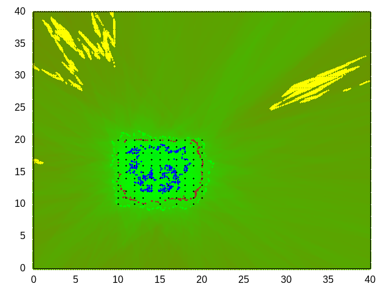

#### Extended isolation forest with revised algorithm
Following table presents the effect of different '-R' parameter values. Parameter '-R' is used to control how wide the interception ***p*** selection range expands from the sample data points. Default value is one, which causes quite small expansion. Here values 5,15,50 and 150 are tested with three different datasets.

|-R value|Two blobs|Square|Circle|
|---|---|---|---|
|0|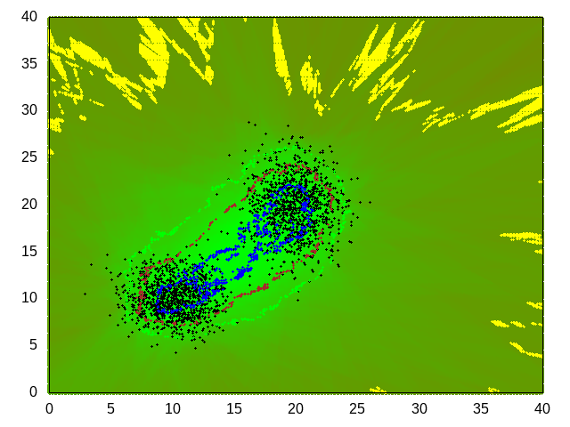||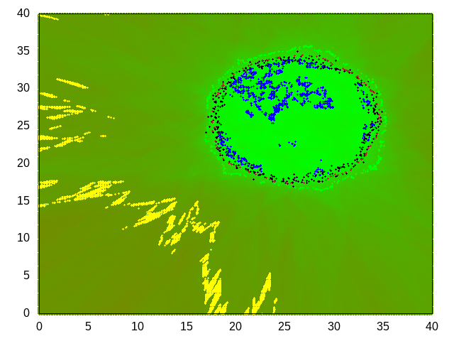|
|25|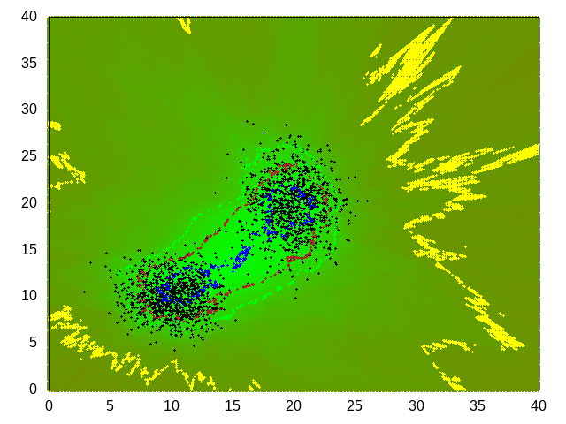|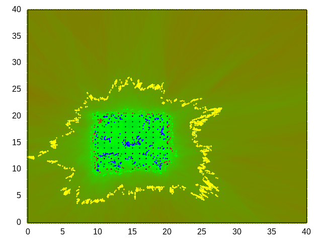|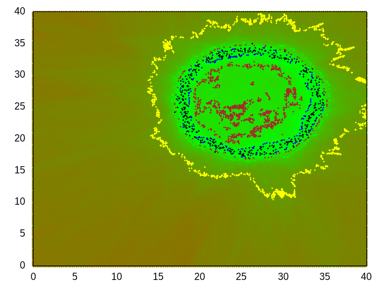|
|75||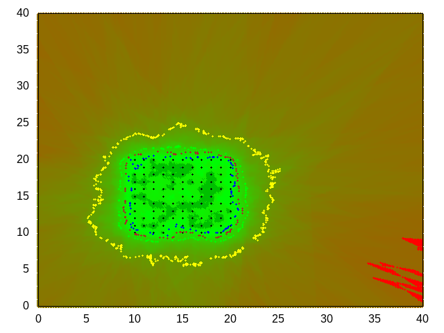|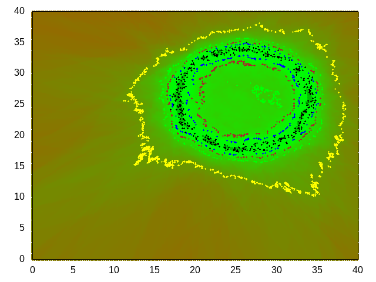|
|200|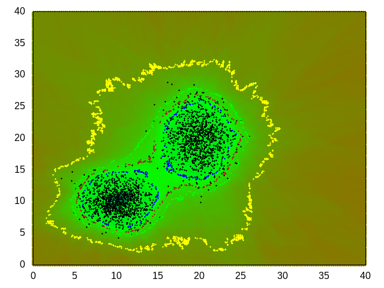|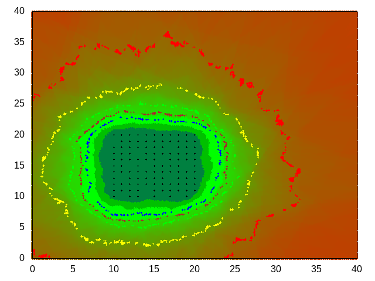||

Following effects are seen:

* '-R' values 0 and 25: Contour lines are quite irregular. Especially the circle hole is not clearly identified as outlier area
* '-R' value 75: contour lines are quite regular. Green line (score value 0.6) could be used as anomaly score if it is assumed that training data does not contain anomalies. Blue or brown (score values 0.5 and 0.55) could be used if training data contains anomalies.
* '-R' value 200: When larger '-R' value are used the score lines are expanded but also the clearly outlier area (reddish) is more close to data map. Meaning when the '-R' value is increased the visible anomaly score slope from 0 to 1 is more steep and visible score value range is more wide (e.g. the blueish area in the middle of square). Also the middle of circle is now clearly outlier area. Also contour lines are following the datasets more closely (see two blobs). So larger '-R' value can be used if data set has meandering contours.

It is also noticeable that circle like maps are quite difficult to get right. In above examples only '-R' value 75 (or little less) is usable if the middle of the circle should be seen as outlier area using score 0.5. This due to the nature of the algorithm, it creates sub spaces spanning over inlier and outlier areas causing bias. 

Low -R values can be beneficial when categorizing data. Lower score values are then concentrated to the center of data map. This can yield better results when different forests (categories) are
overlapping.

#### Tricky data maps
Here is an example of a difficult data map. Two nested circles causes problems because there are adjacent inlier and outlier areas and subareas of the algorithm tend to span over both areas. 
Table below has three examples of double circle with different '-R' values. Contour lines are not used for clarity.

| Case | Two circles |
|---|---|
|Data map||
|-R 75|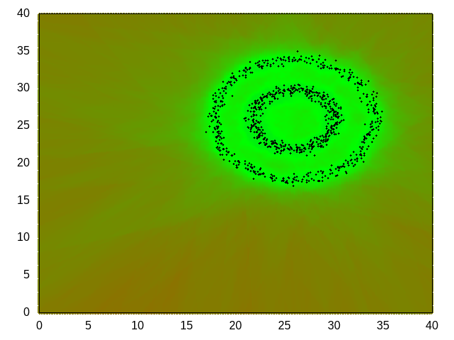|
|-R 150|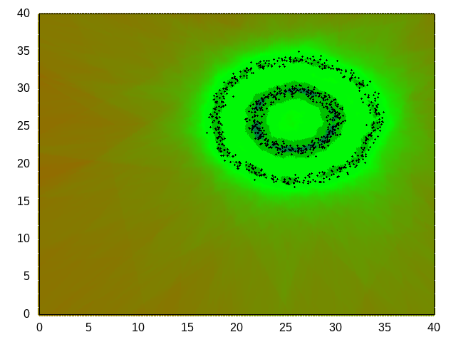|
|-R 200|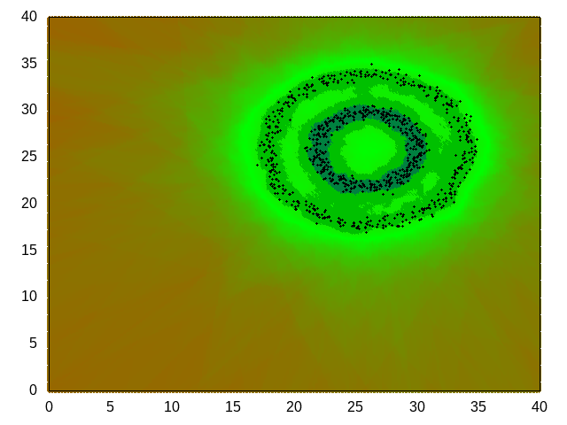|

It is hard to get two outlier circles inside right. There are no clear boundaries, selecting outlier score is not a simple task. Also the inner circle tends to get more higher inlier score (bluish in last picture).

### Saving and updating forest data
The result of training phase can be saved to file to be used in later analysis. Data can also be updated with new training data. 
In following example a square map is updated with a small blob:

| Case | File | Map |
|---|---|---|
|Square|square.csv||
|Small blob|sblob.csv||

Training and saving the square to file square.f:

    ceif -l square.csv -w square.f -R50

Updating the square.f with small blob:

    ceif -r square.f -l sblob.csv -w square.f

Creating anomaly map with commads:

    ceif  -r square.f -a test_matrix.csv -O0.0 -p "%v,0x%x,%s" -o plot_data.csv
    ./make_contour.sh
    gnuplot  -e "datafile='square.csv'" plot.gp

Resulting map in pic.png:

### Performance
Here are some performance test run using covtype.data from [UC Irvine Machine Learning Repository](https://archive.ics.uci.edu/ml/datasets/covertype). File has 55 columns and 581012 rows.
Tests have been run using Intel i5-650 Processor, 3.20 GHz and 8 GB ram.

#### learn with category
First 10 fields are used in analysis and field 55 is used as category field. Forest data is written to file.

    time ceif -w covtype.f1 -l covtype.data -I1-100 -U1-10 -C55

    real    0m1,122s
    user    0m1,077s
    sys     0m0,044s

#### Analyze using forest data from previous run
Anomaly score 0.9 is used to disable printing.

    time ceif -r covtype.f1 -a covtype.data -O0.9
    
    real    0m16,504s
    user    0m16,442s
    sys     0m0,048s

#### Categorizing data
Categorizing takes lot of time because each analyzed row must be run through each forest.

    time ceif -r covtype.f1 -c covtype.data  -p "%c %C %v" -o /dev/null
    
    real    1m52,876s
    user    1m52,340s
    sys     0m0,240s

### Generating test data set with option -T
Option -T can be used to generate a test data set around data sample points. The wideness and sample point density can be adjusted. Default is to generate test data having the same range as 
sample data and each dimension attribute having 256 sample points.

In this example the file 2blob.csv is used for training and the testdata is generated with range adjust value one (app. double size compared to sample point area). And for each 
dimension attribute 512 test values are generated (in this example to total number of test data points is 512*512 = 263169). Only those test data points are written to file
plot_data.csv which have anomaly score value 0.6 or larger.

    ceif -l 2blob.csv -T1 -i 512 -R 250 -O 0.6  -p "%d,0x%x" -o plot_data.csv

File plot_data.csv will have lines like:
    
    -8.655000,-7.965000,0x8B7300
    10.031602,-7.485508,0x807E00
    14.003633,37.394961,0x768800

The output file can be plotted e.g. with gnuplot. Note that data points having score value smaller than 0.6 do not have any color. Also the training set sample points (max 10240 of them)
are printed with black color.

### Scale dimension values for data having significant difference between dimension attribute absolute values
#### No scaling
If training dataset has dimension attribute value ranges with significant differences then the extended isolation forest method causes the attributes having smaller range values
to yield poor results. This is due to the extended isolation forests dot product. The small scale attributes lose their significance if other attributes have much larger absolute values.

In this example a data set having long line shape is used. Training dataset has two attributes having ranges 5...117 and 100 000...2 000 000. The second attribute is much larger that the first. 
If a test data set is generated without dimension scaling the results shows that there is no clear border X attribute test values. All X values are considered equal:

    ceif -l Wtest.csv -R50 -T3  -p "%d,0x%x" -o plot_data.csv -O0.65

The data points having score value 0.65 or larger are printed, note the scale of datapoints.

the whole X range is considered to have score less than 0.65. This probably not the result which was expected.

#### Scale with option -W
Running again with option -W:

    ceif -l Wtest.csv -R50 -T3  -p "%d,0x%x" -o plot_data.csv -O0.65 -W

Result is now better, there is clear 0.65 score range around the data line.

The option -W causes all dimension attributes to be scaled according to the largest attribute range. In the example above the X range 5...117 is scaled 
to the Y range (100 000...2 000 000). This makes both attributes equal in score analysis.
