## Tweaking and testing ceif

Here are some examples generated by running ceif. Examples are 2-dimensional datasets presented in anomaly score maps. 
Examples show how some ceif parameters can be used to change the behaviour of forest training.

### Data samples

Three different datasets are used in this document: two blobs, square and circle:

|Two blobs|Square|Circle|
|---|---|---|
||||

### Used commands

Anomaly maps are generated by running following set of commands (here is the circle as an example). Commands are run in [test](../test) directory:

    ceif -l circle.csv -T1 -Omax -p "%d,0x%x,%s" -o plot_data.csv
    gnuplot plot.gp

Now you have the anomaly score map in file 'pic.png'. Commands explained:

* ceif: Run ceif by using file circle.csv as training data. All points having anomaly score larger or equal than 0 are written to file plot\_data.csv using "%v,0x%x,%s" as printing format. See manual for more about ceif parameters.  Parameters used here:
    * -l: use file circle.csv as training data
    * -T1: generate test data map, value 1 gives one time larger map compared to training data
    * -O0: anomaly sore 0 is used in test data generation, effective all points are printed
    * -p "%d,0x%x,%s": print test data using printf style format
    * -o plot\_data.csv: write test map to plot\_data.csv
* gnuplot: generate score map using plot\_data.csv

    
### Results

#### Extended isolation forest with revised algorithm
Following table presents some score maps using anomaly scores 0, 0.5, 0.5s (with scaling), max and average score. 
Max score is calculated using the sample value having larges anonaly score. Average score is the sample average score adjusted by standard deviation. Sample values are printed using black.
Outlier area is printed using color and non outlier are is white.

|Outlier score value (-O)|Two blobs|Square|Circle|
|---|---|---|---|
|training data||||
|0||||
|0.5||||
|0.5s|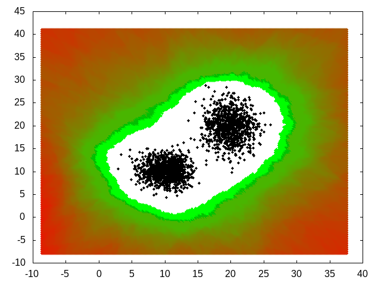|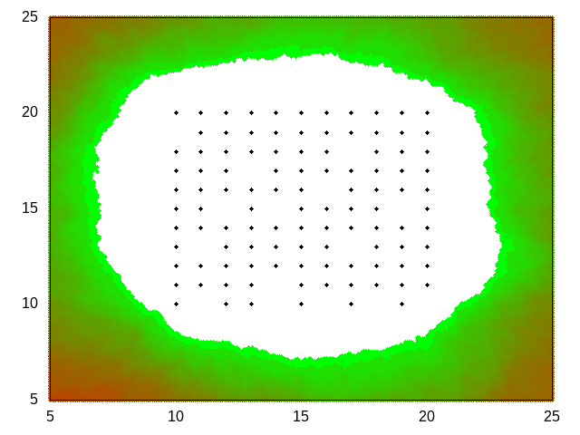|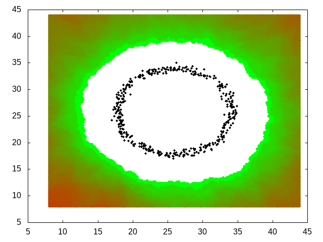|

Outlier score 0.5 is not the same for all cases. In some cases (2blobs and square) it leaves some training data points in outlier area and in circle case it is too large. 
100% score leaves all training data points in inlier area. 

Typically the scaled score 0.5s can be used as a good outlier limit for all cases.

#### Scaled outlier score
If suffix 's' is given with outlier score then the analyzed scores are scaled to range 0..1. Typically score range for normal case is something between 0.3 and 0.85. 
When scaling the minimum score (e.g. 0.33) is scaled to 0 and maximum score (e.g. 0.83) is scaled to 1 and respectively values between them. Forest min/max scores are found by testing. 
Minimum score is the lowest sample score and maximum score is got analyzing huge dimension values.

This gives more consistet score values between different forests and outlier have at least value 0.5. Scaling is used always when categorizing (option -c).

#### Percentage based outlier score
Percentage based score is calculated by sorting all sample scores and taking the score which covers x percent of scores starting from smallest score. 
E.g. the percentage score 50% is the median of all sample scores and 100% is the maximum score of all samples.

Percentage based score can be used to identify bias of a sample set. If score is set to x% then the normal test data should have x% inliers.
If inlier count is not near x% then the tested data set might be have bias. Printing option -v can be used to print statistics analyzed data.

#### Tricky data maps
Here is an example of a difficult data map. Two nested circles causes problems because there are adjacent inlier and outlier areas and subareas of the algorithm tend to span over both areas. 
The effect of the nearest training data point distance analysis is clearly seen here.

| Case | Two circles |
|---|---|
|Data map||
|-O 0s and NEAREST 0||
|-O 0s and NEAREST 1|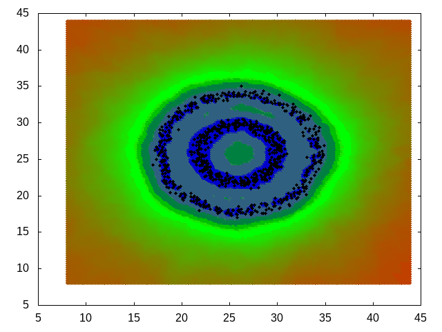|
|-O 0.21s and NEAREST 0|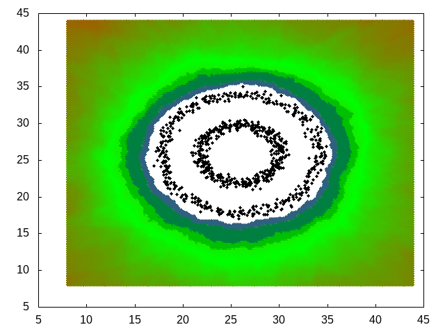|
|-O 0.21s and NEAREST 1|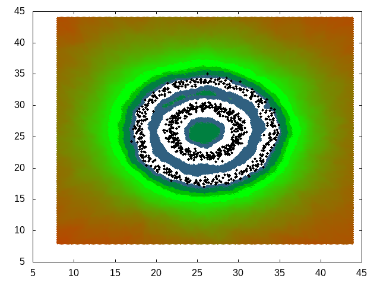|

It is hard to get two outlier circles inside right without nearest training point analysis. In the last example the area between circles could be indentified as outlier area. The caveat is that the processing time with nearest analysis gets longer.

### Saving and updating forest data
The result of training phase can be saved to file to be used in later analysis. Data can also be updated with new training data. 
In following example a square map is updated with a small blob:

| Case | File | Map |
|---|---|---|
|Square|square.csv||
|Small blob|sblob.csv||

Training and saving the square to file square.ceif:

    ceif -l square.csv -Omax -w square.ceif 

Updating the square.ceif with small blob:

    ceif -r square.ceif -l sblob.csv -w square.ceif

Creating anomaly map with commads:

    ceif -r square.ceif -T1 -Omax -p "%d,0x%x,%s" -o plot_data.csv   
    gnuplot plot.gp

Resulting map in pic.png, inlier area is white:

### Performance
Here are some performance test run using covtype.data from [UC Irvine Machine Learning Repository](https://archive.ics.uci.edu/ml/datasets/covertype). File has 55 columns and 581012 rows.
Tests have been run using Intel i5-650 Processor, 3.20 GHz and 8 GB ram.

#### learn with category
First 10 fields are used in analysis and field 55 is used as category field. Forest data is written to file.

    time ceif -w covtype.f1 -l covtype.data -I1-100 -U1-10 -C55

    real    0m1,122s
    user    0m1,077s
    sys     0m0,044s

#### Analyze using forest data from previous run
Anomaly score 0.9 is used to disable printing.

    time ceif -r covtype.f1 -a covtype.data -O0.9
    
    real    0m16,504s
    user    0m16,442s
    sys     0m0,048s

#### Categorizing data
Categorizing takes lot of time because each analyzed row must be run through each forest.

    time ceif -r covtype.f1 -c covtype.data  -p "%c %C %v" -o /dev/null
    
    real    1m52,876s
    user    1m52,340s
    sys     0m0,240s

### Generating test data set with option -T
Option -T can be used to generate a test data set around data sample points. The wideness and sample point density can be adjusted. Default is to generate test data having the same range as 
sample data and each dimension attribute having 256 sample points.

In this example the file 2blob.csv is used for training and the testdata is generated with range adjust value one (app. double size compared to sample point area). And for each 
dimension attribute 512 test values are generated (in this example to total number of test data points is 512*512 = 263169). Only those test data points are written to file
plot_data.csv which have anomaly score value 0.6 or larger.

    ceif -l 2blob.csv -T1 -i 512 -O 0.6  -p "%d,0x%x" -o plot_data.csv

File plot_data.csv will have lines like:
    
    -8.655000,-7.965000,0x8B7300
    10.031602,-7.485508,0x807E00
    14.003633,37.394961,0x768800

The output file can be plotted e.g. with gnuplot. Note that data points having score value smaller than 0.6 do not have any color. Also the training set sample points (max 10240 of them)
are printed with black color.

### Scale dimension values for data having significant difference between dimension attribute absolute values
#### No scaling
If training dataset has dimension attribute value ranges with significant differences then the extended isolation forest method causes the attributes having smaller range values
to yield poor results. This is due to the extended isolation forests dot product. The small scale attributes lose their significance if other attributes have much larger absolute values.
As default ceif scales the dimension values, this can be disable by rc-file option AUTO_SCALE.

In this example a data set having long line shape is used. Training dataset has two attributes having ranges 5...117 and 100 000...2 000 000. The second attribute is much larger that the first. 
If a test data set is generated without dimension scaling the results shows that there is no clear border X attribute test values. All X values are considered equal:

    ceif -l Wtest.csv -T3  -p "%d,0x%x" -o plot_data.csv -O0.65

The data points having score value 0.65 or larger are printed, note the scale of datapoints.

the whole X range is considered to have score less than 0.65. This probably not the result which was expected.

#### Run with scaling 
Running again with rc-file option "NEAREST 1" (1 is the default value).

    ceif -l Wtest.csv -T3  -p "%d,0x%x" -o plot_data.csv -O0.65 

Result is now better, there is clear 0.65 score range around the data line.

Values are scaled according to the largest attribute range. In the example above the X range 5...117 is scaled 
to the Y range (100 000...2 000 000). This makes both attributes equal in score analysis.

### Print analyzed data average info
Option -v can be used to print average score and other statistics calculated from analyzed data (given by option -a). If option -v is used then ceif calculates the total number of analyzed lines and
the number of lines which had higher score than outlier score. Option -v requires a printing mask, which can have following directives:

| Directive | Meaning |
|----|----|
| %r | Number of analyzed rows|
| %s | Anomaly score|
| %S | Average data anomaly score|
| %h | Number of analyzed rows having high outlier score|

Example using 2blob.csv:

    ceif -l 2blob.csv -O90% -w 2blob.ceif
    ceif -r 2blob.ceif -a 2blob.csv -p "" -v "%r %h %s %S"
    2000 200 0.373435 0.319595

Training data set is saved to 2blob.ceif with outlier score 90%. Then same data set is analyzed against the training data. Statistics is printed using option -v, single
dataline printing is suppressed with option -p "". Output values:

- 2000: Total number of input lines
- 200: Number of lines having larger score than 90% of training data (expected value: 2000 * 10% = 200)
- 0.373435: Percentage based anomaly score (means that 90% of training data have lower score than 0.373435)
- 0.319595: Test data average score

This can be used when analyzing the input data as whole. If the number printed by %h is large compared to expected value (here 10% of samples) then the whole analyzed data set might be have bias.

### How to categorize
ceif can be used to categorize data having several categories. If training data has several categories then the data to be categorized is analyzed using all forests (categories) and the forest giving the lowest
outlier score is considered to be the best category for the data. If scaled outlier score is given by option -O then the results are limited by this value. Category with lowest score is accepted (and printed)
only if the lowest score found is lower than the score given by option -O. 

Following examples are based on training data in file [3cat\_samples.csv](../test/3cat_samples.csv). File has two dimension data (fields 1-2) with category field (field number 3).

Training data map:

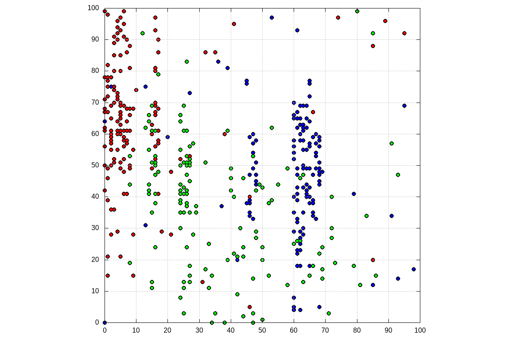

Category strings are gnuplot rgb values for red, green and blue. They are handy in printing. Category job is run using [3cat\_test.csv](../test/3cat_test.csv) (100 * 100 data points), category string here is X, because it is unknown and to be found.
Tests are run with different outlier score values and with different NEAREST value in ~/.ceifrc.

Example of making the training data, field number 3 is the category string field, no decimals are needed for saving the data:

    ceif -l 3cat_samples.csv -C3 -d0 -w 3cat.ceif

Example of running the category analysis with score value 0.5s, results are saved in plot\_data.csv:

    ceif -r 3cat.ceif -c 3cat_test.csv -p "%d,%C" -O0.5s -o plot_data.csv

Category value maps with different run options:

|Outlier score / NEAREST value|NEAREST 1|NEAREST 0|
|---|---|---|
|no outlier score given|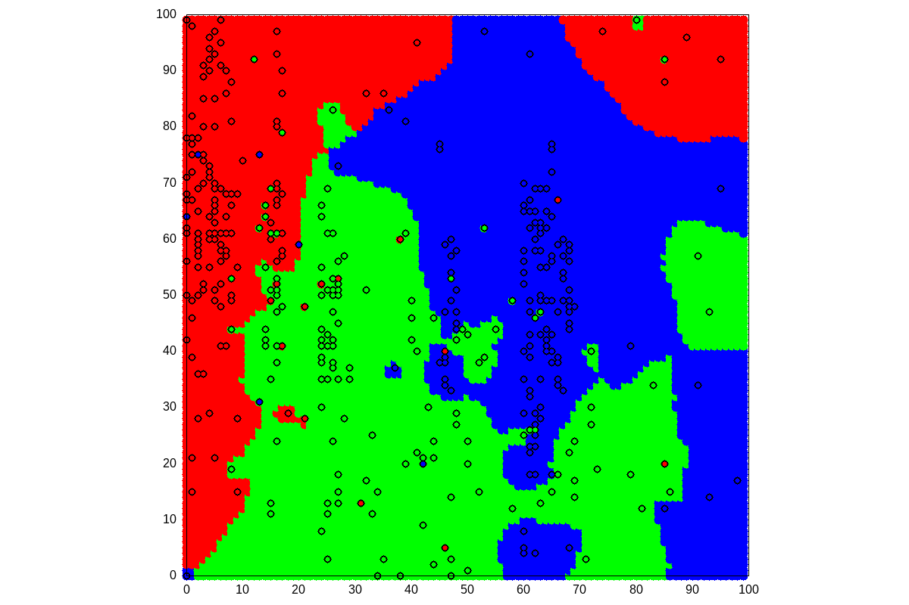|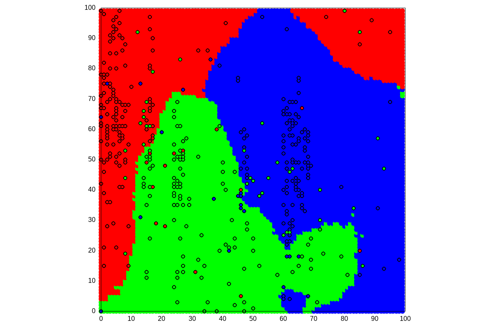|
|0.5s||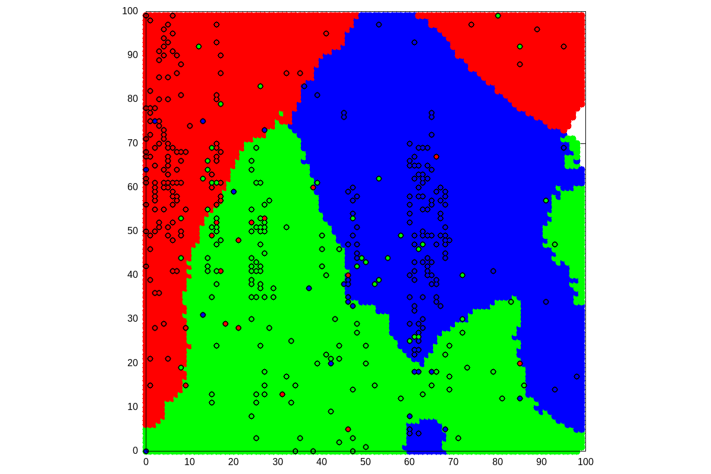|
|0.3s|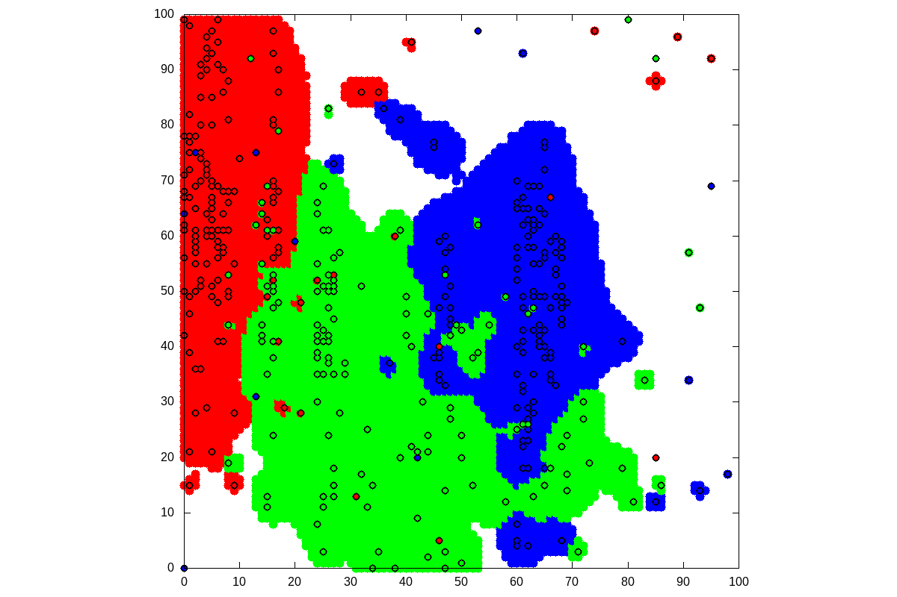|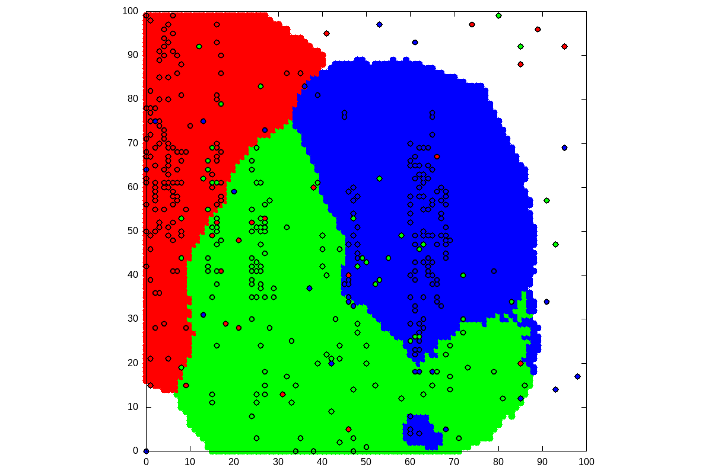|

Following effects are seen:

- With NEAREST 1 the boundaries between different categories are more accurate.
- Lower the outlier score means more data points are not associated with any category (white areas)

A mp4 movie using the same dataset. Movies shows results when score is decrement from 0.99 to 0.0 with 0.01 increments. White areas starts to be seen after score value 0.7.

https://user-images.githubusercontent.com/50619541/126327929-b68fc5e0-c229-4c61-aa10-a79a87ebd19b.mp4

### Sampling large data sets to be analyzed for outliers
If data sets for outlier detection is very large and sampling does not effect results too much then the configuration variable ANALYZE\_SAMPLING can be used to reduce prosessing time.
ANALYZE\_SAMPLING tells the minimum number of rows to be analyzed (using option -a, default is take all input rows). If there are more rows than ANALYZE\_SAMPLING, 
then reservoir sampling type method is used to select the rest of the rows. 

Total number of rows to be analyzed is app.:

    k * (ln(x/k) + 1)

where

    k = ANALYZE_SAMPLING value
    x = Total number of input rows.

As an example the following table gives an idea how many input rows will be approximately analyzed when ANALYZE\_SAMPLING is set to value 10 000.

|Total number of input rows|Rows analyzed when ANALYZE\_SAMPLING is set to 10 000|
|---|---|
|50 000|26 094|
|500 000|49 120|
|2 000 000|62 983|
|20 000 000|86 009|

### Printing dimension metrics together
Option -j (or rc-file variable PRINT\_DIMENSION) and printing directive can be used in order to print all dimension metrics in a group. In following example outlier attributes are printed in XML type of format.
First make forest info file from 2blob.csv file:
    ceif -l 2blob.csv -w 2blob.ceif
File sblob.csv is analyzed against 2blob.ceif and outlier are printed in XML style with outlier score, input row number and row dimension attribute values and attribute related score:
<pre>
    cat  sblob.csv | ../src/ceif -r 2blob.ceif -O0.674s -a - -j " &lt;attr idx=%i&gt;\n  &lt;value&gt;%d&lt;/value&gt;\n  &lt;score&gt;%e&lt;/score&gt;\n &lt;/attr&gt;\n" -p "&lt;outlier score=%s row=%n&gt;\n%m&lt;/outlier&gt;" -e ""
    &lt;outlier score=0.675003 row=7&gt;
     &lt;attr idx=1&gt;
      &lt;value&gt;24.760000&lt;/value&gt;
      &lt;score&gt;0.260190&lt;/score&gt;
     &lt;/attr&gt;
     &lt;attr idx=2&gt;
      &lt;value&gt;31.390000&lt;/value&gt;
      &lt;score&gt;0.621133&lt;/score&gt;
     &lt;/attr&gt;
   &lt;/outlier&gt;
   &lt;outlier score=0.674121 row=13&gt;
    &lt;attr idx=1&gt;
     &lt;value&gt;24.340000&lt;/value&gt;
     &lt;score&gt;0.207147&lt;/score&gt;
    &lt;/attr&gt;
    &lt;attr idx=2&gt;
     &lt;value&gt;31.850000&lt;/value&gt;
     &lt;score&gt;0.642780&lt;/score&gt;
    &lt;/attr&gt;<
   &lt;/outlier&gt;
</pre>
### Clusters and dimension attribute scores
#### Clusters
Ceif tries to find forest sample data cluster using method below. Clusters in ceif have all the same fixed size and shape of sphere. The size can be controlled by rc-file variable CLUSTER\_SIZE. Cluster are not overlapping.

Method:

1. The cluster size is the distance from the sample having the lowest score to the farthermost sample multiplyed by CLUSTER\_SIZE. Smaller CLUSTER\_SIZE means more clusters. Cluster size is now relative to sample space.
2. Take the sample with lowest score. This is the first cluster center.
3. Calculate the number of samples in cluster (A sample is in cluster if the distance from cluster center is smaller than the cluster distance calculated in step 1)
4. After all samples in cluster are found take the next sample having smallest score not yet in any cluster as next cluster center and calculate samples in this cluster
5. Continue with step 4 until all samples are analyzed
6. Remove clusters having only few samples

#### Dimension attribute score
When analysing outliers it is often usefull to know which dimension attribute is causing the dimension to be outlier. This is not revealed by isolation forest method, only dimension total score is.
Ceif uses cluster centers in dimension attribute score analysis by assigning each outlier dimension attribute value to each cluster center by one by one. The cluster center values changed by 
one attribute is then analysed and the lowest score found is considered as the dimension attribute score.

This assumes that if dimension attribute value in any cluster center causes the cluster center to be outlier (only high scores are found among cluster centers) then the dimension attribute is probably causing the 
dimension to be outlier. This is not always true, even if all attributes give low score still the dimension as whole can be outlier.

Attribute scores can be printed using directive %e.
