## Tweaking and Testing ceif

Here are some examples generated by running `ceif`. The examples use 2-dimensional datasets visualized as anomaly score maps, illustrating how `ceif` parameters influence model training and inference.

### Data Samples

Three different baseline datasets are used in this introductory comparison: two blobs, square, and circle:

|Two blobs|Square|Circle|
|---|---|---|
|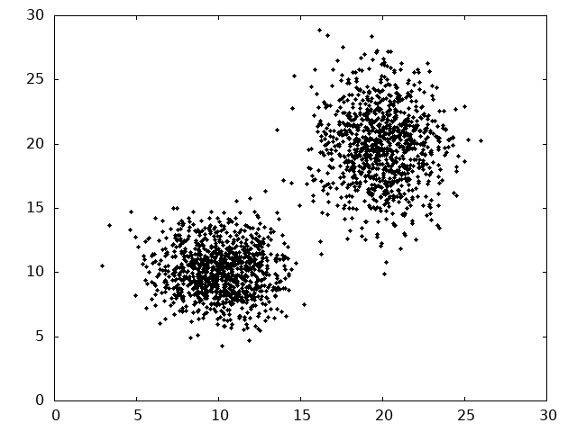|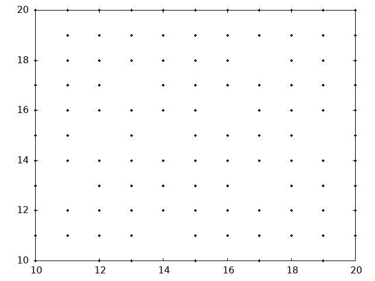|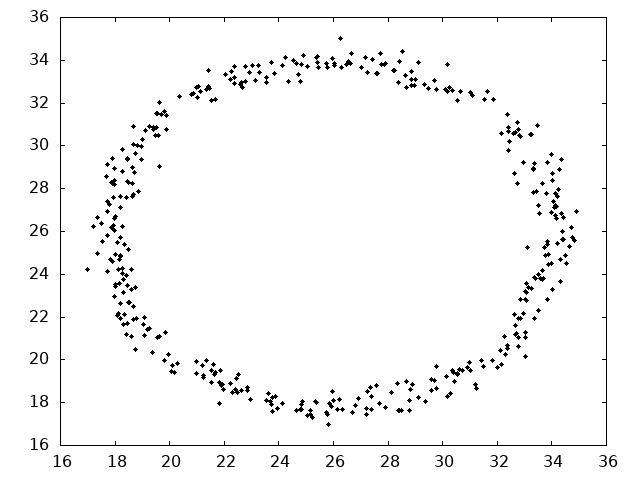|

### Used Commands

Anomaly maps are generated by running the following set of commands (using circle as an example) inside the [test](../test) directory:

    ceif -l circle.csv -T1 -O0s -p "%d,0x%x,%s" -o plot_data.csv
    gnuplot plot.gp

This generates an anomaly score map in `pic.png`. Command breakdown:

* `ceif`: Run `ceif` using `circle.csv` as training data. All points having an anomaly score greater than or equal to 0 are written to `plot_data.csv` using format `"%d,0x%x,%s"`. Parameters used:
    * `-l`: Use `circle.csv` as training data.
    * `-T1`: Generate a test dataset map; a value of 1 doubles the map area compared to the training data.
    * `-O0s`: An anomaly score threshold of 0 is used in test generation, printing all evaluated points.
    * `-p "%d,0x%x,%s"`: Print test data using printf-style formatting.
    * `-o plot_data.csv`: Write test map to `plot_data.csv`.
* `gnuplot`: Render the score heatmap from `plot_data.csv`.

    
### Results

#### Extended Isolation Forest with Revised Algorithm
The following table presents score heatmaps across thresholds 0, 0.5, and 0.5s (scaled). 
Training samples are shown in black. Outlier regions are displayed in color (yellow to red gradient), while inlier regions are white.

|Outlier score value (-O)|Two blobs|Square|Circle|
|---|---|---|---|
|training data||||
|0|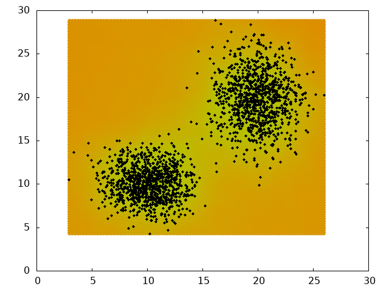|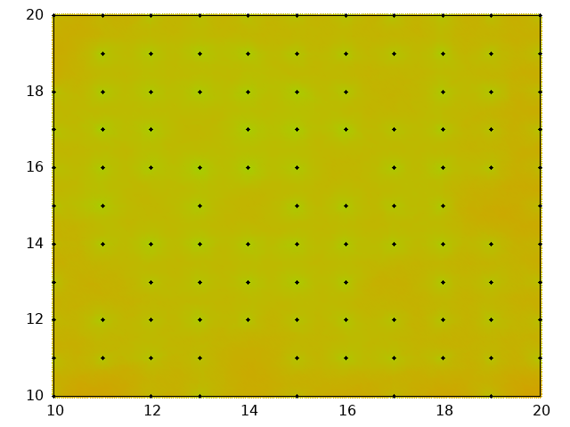|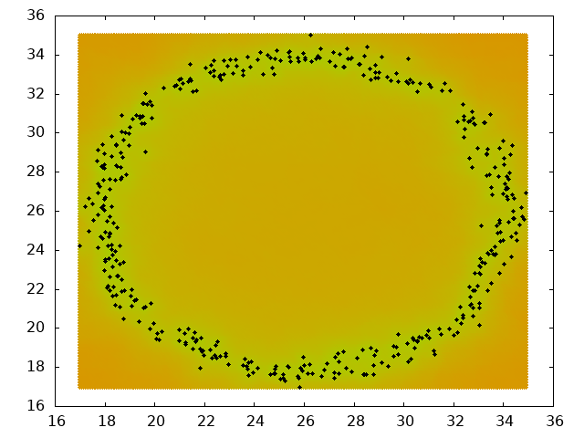|
|0.5|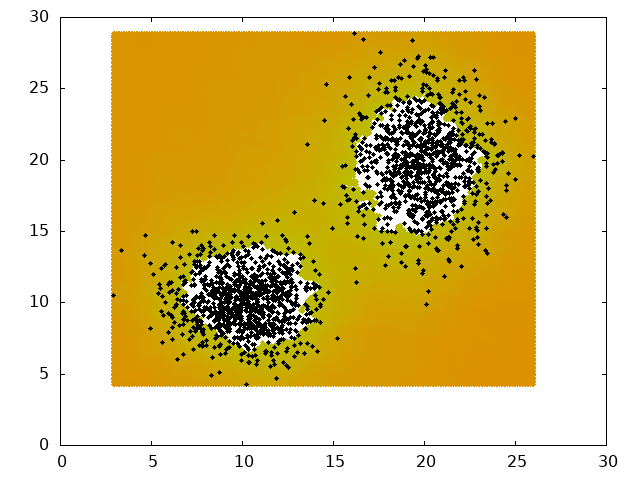|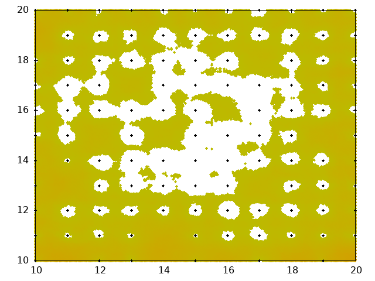|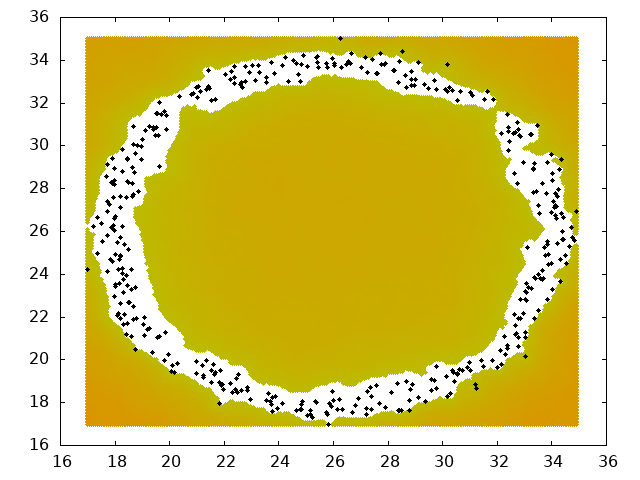|
|0.5s|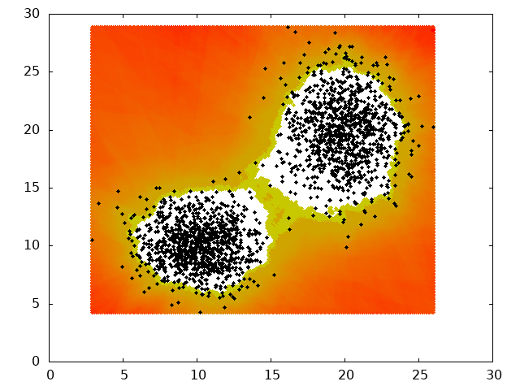|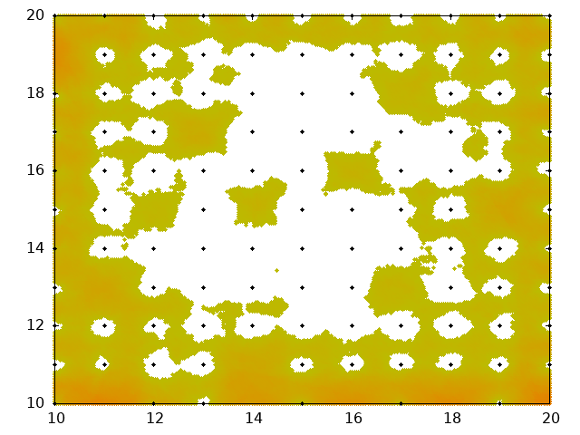|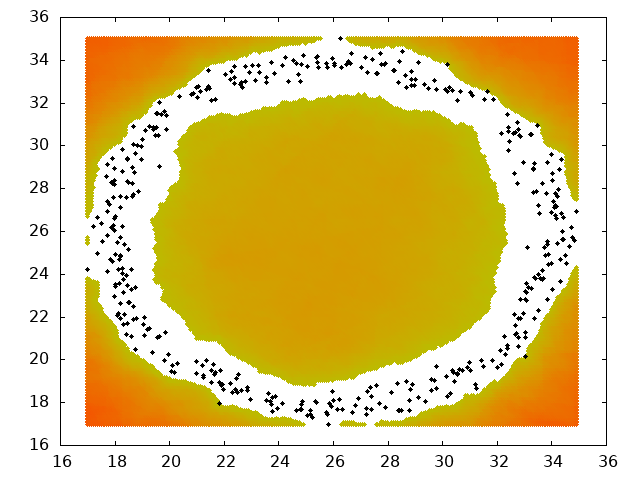|

A raw outlier score of 0.5 behaves differently across topologies. For 2blobs and square, it marks some valid training points as outliers, while for circle it is too permissive.
A 100% percentile score preserves all training data points within the inlier region.

Typically, the scaled score threshold `0.5s` provides a reliable default boundary across most distributions.

#### Scaled Outlier Score
When suffix 's' is appended to the outlier score, analyzed scores are scaled to the range 0..1. Typical raw scores for normal distributions fall between 0.3 and 0.85. 
During scaling, the minimum observed score (e.g., 0.33) maps to 0 and the maximum score (e.g., 0.83) maps to 1, with intermediate values interpolated proportionally.
The minimum score is the lowest sample score, and the maximum score is determined by probing extreme dimension boundaries.

This provides consistent scoring scales across distinct forests, ensuring true outliers score at least 0.5. Scaling is always enabled during categorization (option -c).

#### Percentage-Based Outlier Score
A percentage-based score sorts all sample scores and selects the value covering $x$ percent of the distribution. 
For example, a 50% score corresponds to the median sample score, while 100% represents the maximum sample score.

Percentage scores can help identify distribution shift or bias: if the threshold is set to $x\%$, standard test data should exhibit approximately $x\%$ inliers.
If inlier counts deviate significantly, the test dataset may have distribution drift. The `-v` option prints these summary statistics.

#### Complex Topologies
Nested non-convex shapes, such as concentric circles and complex synthetic topologies, present challenges because random hyperplanes can easily bridge across separated inlier and outlier bands. 
Here, the nearest training point distance adjustment (`NEAREST 1`, default) is critical to resolve voids, narrow channels, and fine boundaries:

| Case | Two circles | Complex |
|---|---|---|
|Data map|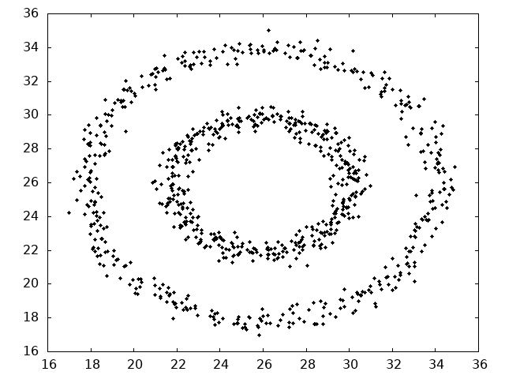|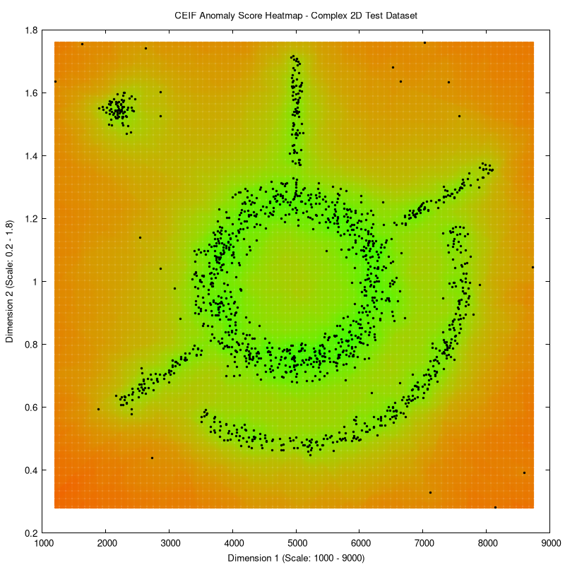|
|-O 0s and NEAREST 0|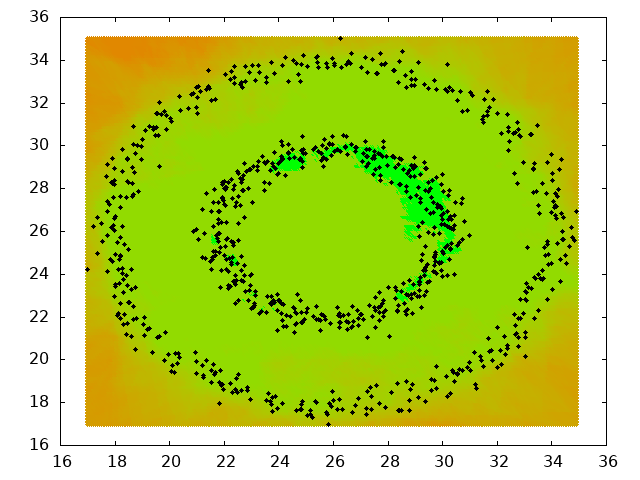|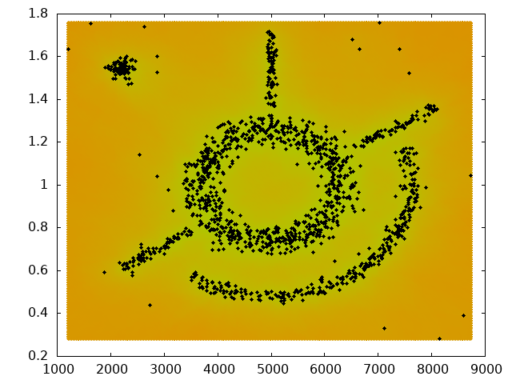|
|-O 0s and NEAREST 1|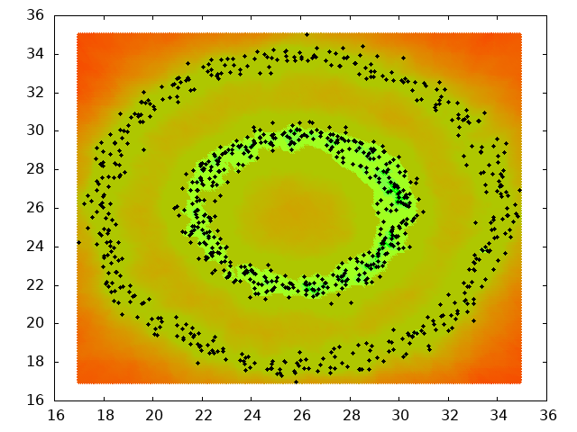|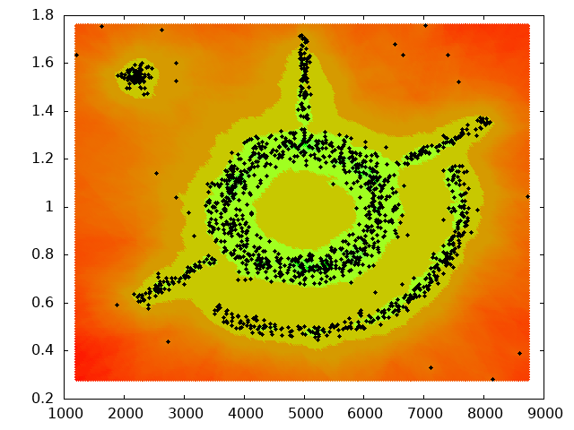|
|-O 0.45s and NEAREST 0|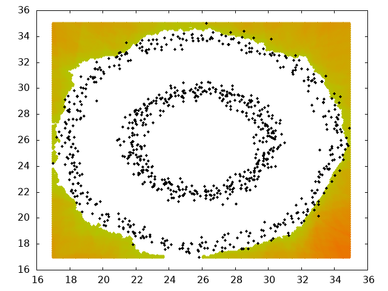|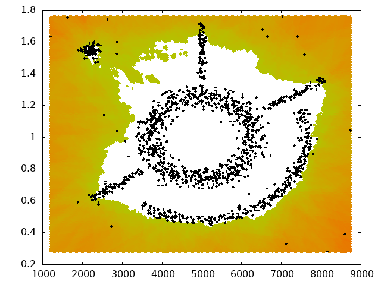|
|-O 0.45s and NEAREST 1|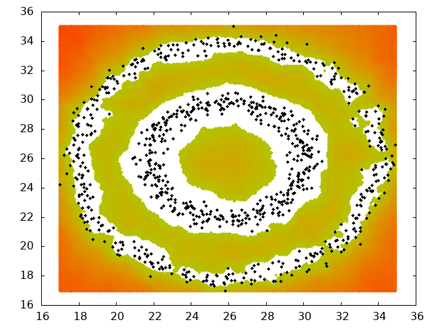|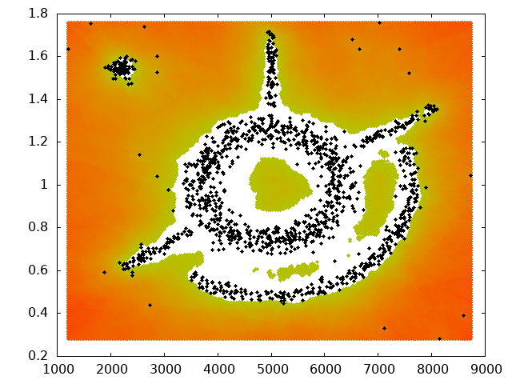|
|-O 97% and NEAREST 1|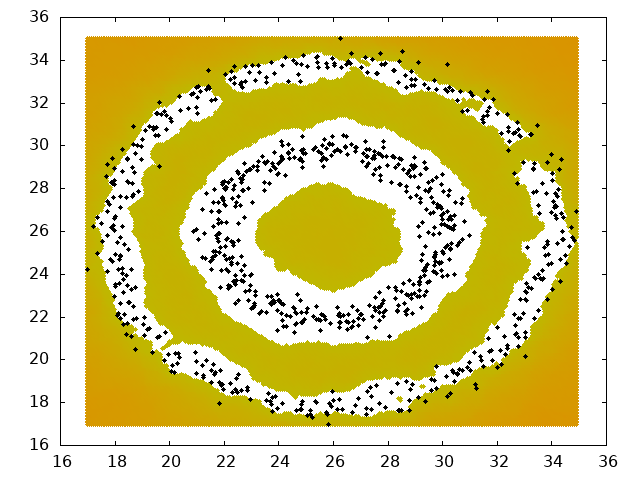|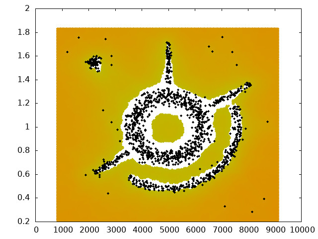|

Without nearest-point distance weighting (`NEAREST 0`), isolating internal voids and gaps between separate structures is difficult—hyperplanes span across empty space, incorrectly grouping distinct components into a single connected inlier mass. With `NEAREST 1`, the spaces between concentric rings and the canals of complex shapes are cleanly identified as outlier zones, while the white inlier envelope crisply traces the actual sample points.

For complex geometries, combining `NEAREST 1` with a percentile score such as `-O 97%` (optionally with higher tree counts like `-t 200`) produces exceptionally sharp, tight inlier envelopes that hug fine geometric features while preserving internal voids. The trade-off is a slight increase in evaluation time.

### Saving and Updating Forest Data
The result of the training phase can be saved to a file for later inference, and iteratively updated with new training batches. 
In the following example, a square model is updated with a smaller secondary blob:

| Case | File | Map |
|---|---|---|
|Square|square.csv||
|Small blob|sblob.csv|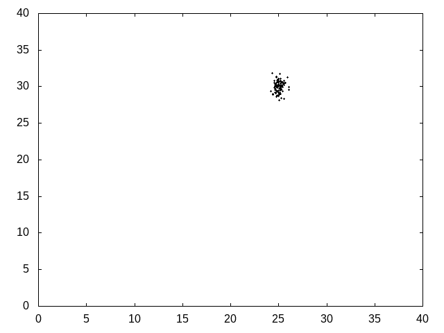|

Training and saving the square to `square.ceif`:

    ceif -l square.csv -w square.ceif 

Updating `square.ceif` with the secondary blob:

    ceif -r square.ceif -l sblob.csv -w square.ceif

Creating the anomaly map with commands:

    ceif -r square.ceif -T1 -O0s -p "%d,0x%x,%s" -o plot_data.csv   
    gnuplot plot.gp

Resulting map in pic.png, inlier area is white:

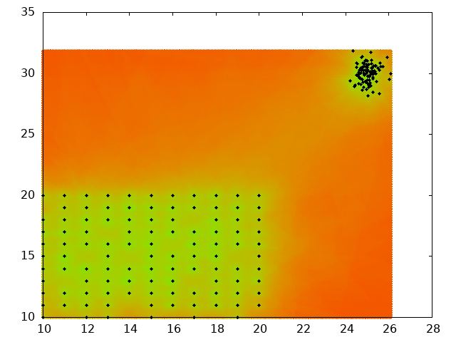

### Performance
Here are benchmark runs using `covtype.data` from the [UC Irvine Machine Learning Repository](https://archive.ics.uci.edu/ml/datasets/covertype). The file contains 55 columns and 581,012 rows.
Tests were run on an Intel i5-650 Processor (3.20 GHz, 8 GB RAM).

#### Learn with Category
The first 10 fields are used in analysis, and field 55 serves as the category key. Forest data is written to a file:

    time ceif -w covtype.f1 -l covtype.data -I1-100 -U1-10 -C55

    real    0m1,122s
    user    0m1,077s
    sys     0m0,044s

#### Analyze Using Forest Data from Previous Run
Outlier score threshold 0.9 is used to suppress printing:

    time ceif -r covtype.f1 -a covtype.data -O0.9
    
    real    0m16,504s
    user    0m16,442s
    sys     0m0,048s

#### Categorizing Data
Categorizing takes more time because each analyzed row must be evaluated against every category's forest:

    time ceif -r covtype.f1 -c covtype.data -p "%c %C %v" -o /dev/null
    
    real    1m52,876s
    user    1m52,340s
    sys     0m0,240s

### Generating Test Datasets with Option -T
Option -T can be used to generate a test dataset around sample points. Spatial span and sample density can be customized. By default, test data spans the same range as the training data with 256 test points per dimension.

In this example, `2blob.csv` is used for training, and test data is generated with a range adjustment factor of 1 (approximately doubling the bounding area). For each dimension attribute, 512 test values are generated (yielding $512 \times 512 = 262,144$ total test points). Only points with an anomaly score of 0.6 or higher are written to `plot_data.csv`:

    ceif -l 2blob.csv -T1 -i 512 -O 0.6 -p "%d,0x%x" -o plot_data.csv

The resulting `plot_data.csv` contains rows such as:
    
    -8.655000,-7.965000,0x8B7300
    10.031602,-7.485508,0x807E00
    14.003633,37.394961,0x768800

The output file can be plotted with gnuplot. Points with scores below 0.6 are left uncolored. Original training samples (up to 10,240 points) are plotted in black:

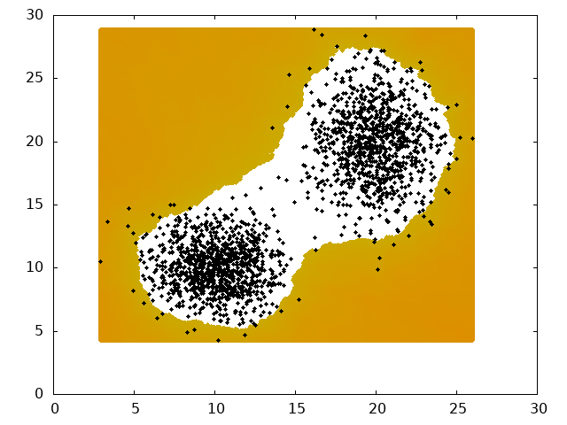

### Scaling Dimension Values Across Differing Attribute Magnitudes
#### Without Scaling
If training datasets feature dimensions with vastly different value ranges, standard dot products cause attributes with smaller numerical magnitudes to lose their influence on splits.
By default, `ceif` normalizes dimension scales automatically; this can be disabled via the rc-file option `AUTO_SCALE 0`.

In this example, an elongated dataset is evaluated with two attributes spanning ranges 5–117 and 100,000–2,000,000. The second attribute has much larger absolute values.
If a test dataset is generated without dimension scaling, the X attribute has no discriminative influence:

    ceif -l Wtest.csv -T3 -p "%d,0x%x" -o plot_data.csv -O0.65

Points with scores of 0.65 or greater are plotted:

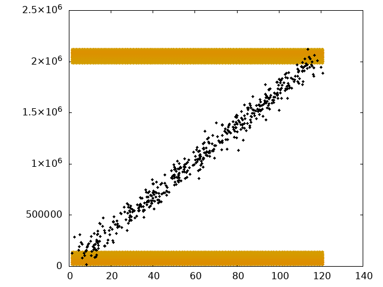

The entire X axis is treated as having scores below 0.65, which is not the desired behavior.

#### Running with Scaling
Running again with dimension scaling enabled (default behavior):

    ceif -l Wtest.csv -T3 -p "%d,0x%x" -o plot_data.csv -O0.65 

The anomaly boundary cleanly outlines the linear cluster:

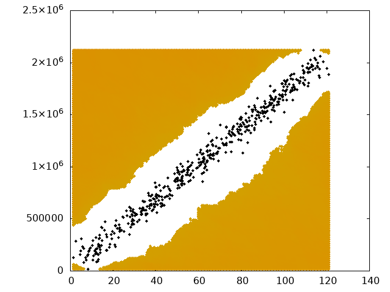

Values are normalized relative to the largest attribute range, ensuring both attributes contribute equally to hyperplane projections.

### Summary Statistics for Analyzed Data
Option -v prints summary statistics calculated from analyzed data (-a). When specified, `ceif` computes total rows evaluated and the number of rows exceeding the outlier threshold. Option -v accepts a format string supporting the following directives:

| Directive | Meaning |
|----|----|
| %r | Number of analyzed rows|
| %s | Anomaly score threshold|
| %S | Average anomaly score across dataset|
| %h | Number of rows exceeding outlier threshold|

Example using `2blob.csv`:

    ceif -l 2blob.csv -O90% -w 2blob.ceif
    ceif -r 2blob.ceif -a 2blob.csv -p "" -v "%r %h %s %S"
    2000 200 0.373435 0.319595

The training dataset is saved to `2blob.ceif` with a 90th-percentile threshold. The file is then analyzed against the trained model. Summary statistics are printed with option -v, while per-row output is suppressed with `-p ""`. Output breakdown:

- 2000: Total number of input lines
- 200: Number of lines having scores higher than 90% of training data (expected: $2000 \times 10\% = 200$)
- 0.373435: Percentile-based anomaly score threshold
- 0.319595: Average test dataset score

This is useful for monitoring batch distributions. If %h deviates significantly from the expected count (here 10%), the analyzed dataset may exhibit distribution shift.

### How to Categorize
`ceif` can classify data across multiple categories. Each input row is evaluated against all category forests; the forest yielding the lowest anomaly score represents the best category match.
When a scaled score threshold (-O) is provided, classifications are filtered: the category with the lowest score is accepted only if its score is below the threshold.

The following examples use training data from [3cat\_samples.csv](../test/3cat_samples.csv), which contains 2-dimensional features (fields 1-2) and a category key (field 3):

Training data distribution:

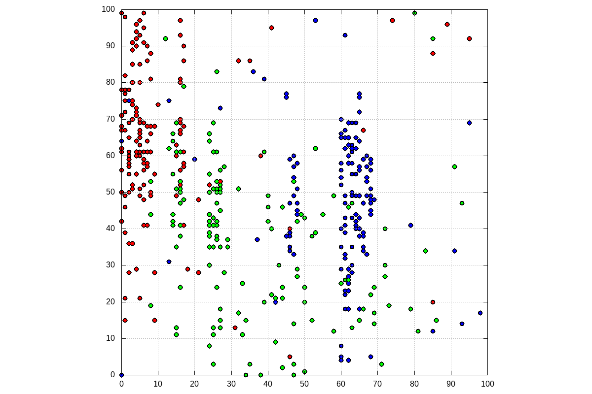

Category keys are RGB strings (`red`, `green`, `blue`). Classification is evaluated using [3cat\_test.csv](../test/3cat_test.csv) ($100 \times 100$ grid points) where category values are unknown (`X`).

Training and saving the multi-category model:

    ceif -l 3cat_samples.csv -C3 -d0 -w 3cat.ceif

Evaluating classifications with a scaled threshold of 0.5s:

    ceif -r 3cat.ceif -c 3cat_test.csv -p "%d,%C" -O0.5s -o plot_data.csv

Category value maps across configurations:

|Outlier score / NEAREST setting|NEAREST 1|NEAREST 0|
|---|---|---|
|No outlier score given|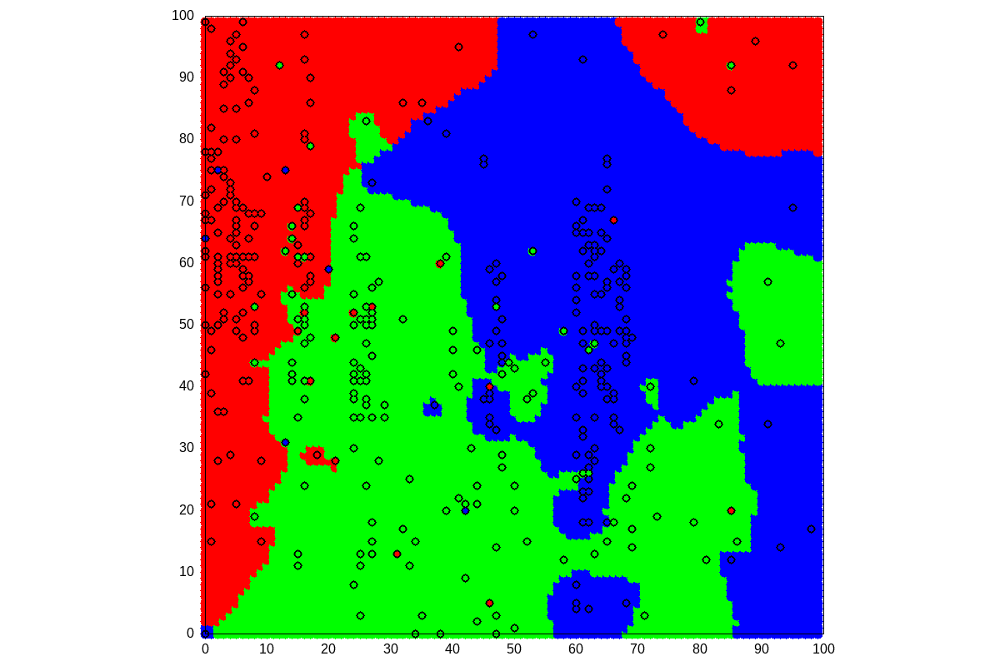|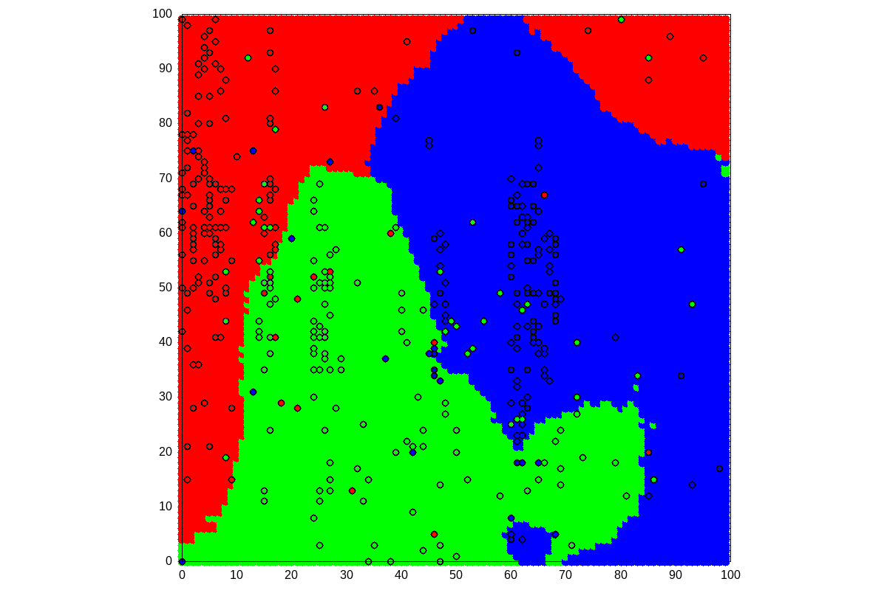|
|0.5s|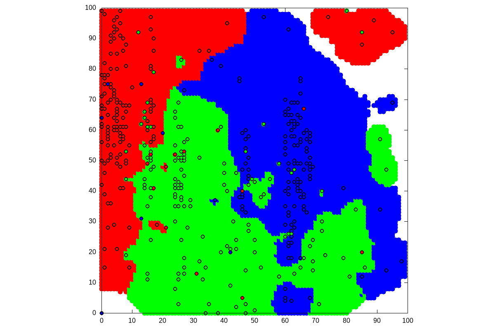|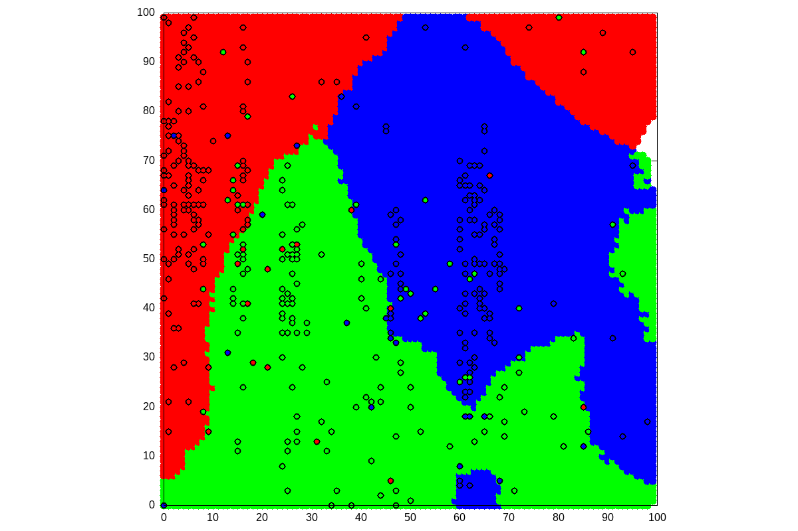|
|0.3s|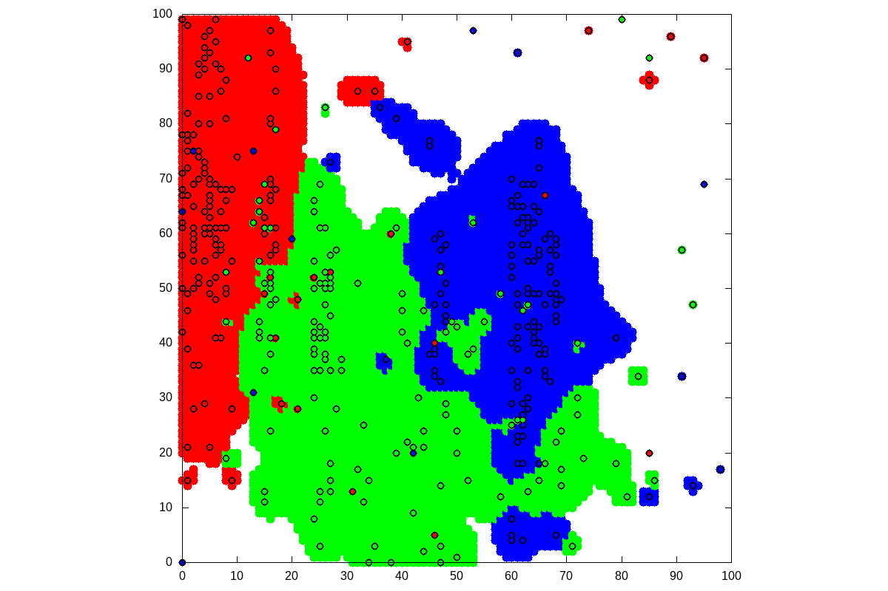|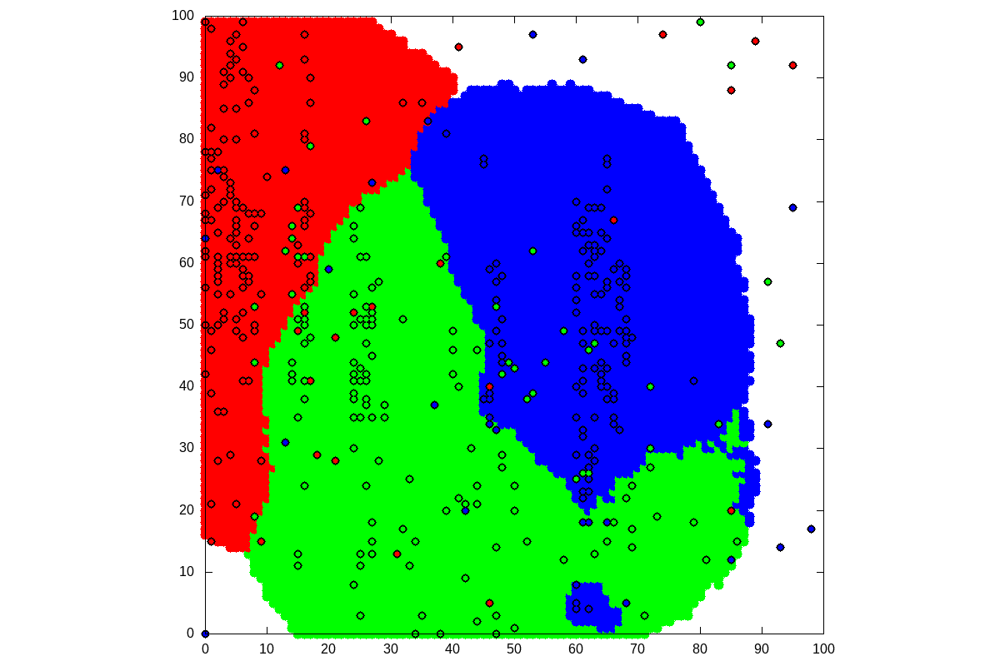|

Key observations:
- `NEAREST 1` provides sharper, more accurate classification boundaries between categories.
- Lower outlier thresholds leave ambiguous boundary regions unassigned (white areas).

An MP4 animation illustrating classifications as the threshold decreases from 0.99 to 0.0 in increments of 0.01:
https://user-images.githubusercontent.com/50619541/126327929-b68fc5e0-c229-4c61-aa10-a79a87ebd19b.mp4

### Sampling Large Datasets
For massive datasets where approximate sampling is acceptable, the configuration variable `ANALYZE_SAMPLING` reduces processing time.
`ANALYZE_SAMPLING` defines the baseline number of rows evaluated before streaming reservoir sampling activates.

Estimated analyzed row count:

    k * (ln(x/k) + 1)

Where:
    k = ANALYZE_SAMPLING setting
    x = Total input row count

Approximate rows evaluated when `ANALYZE_SAMPLING` is set to 10,000:

|Total Input Rows|Rows Evaluated (`ANALYZE_SAMPLING 10000`)|
|---|---|
|50,000|26,094|
|500,000|49,120|
|2,000,000|62,983|
|20,000,000|86,009|

### Grouped Dimension Attribute Metrics
Option -j (or rc-file setting `PRINT_DIMENSION`) allows dimension metrics to be grouped and formatted together (e.g., in XML format).
First, build a model from `2blob.csv`:

    ceif -l 2blob.csv -w 2blob.ceif

Analyze `sblob.csv` against `2blob.ceif`, outputting XML-structured anomaly reports:
<pre>
    cat sblob.csv | ../src/ceif -r 2blob.ceif -O0.674s -a - -j " &lt;attr idx=%i&gt;\n  &lt;value&gt;%d&lt;/value&gt;\n  &lt;score&gt;%e&lt;/score&gt;\n &lt;/attr&gt;\n" -p "&lt;outlier score=%s row=%n&gt;\n%m&lt;/outlier&gt;" -e ""
    &lt;outlier score=0.675003 row=7&gt;
     &lt;attr idx=1&gt;
      &lt;value&gt;24.760000&lt;/value&gt;
      &lt;score&gt;0.260190&lt;/score&gt;
     &lt;/attr&gt;
     &lt;attr idx=2&gt;
      &lt;value&gt;31.390000&lt;/value&gt;
      &lt;score&gt;0.621133&lt;/score&gt;
     &lt;/attr&gt;
   &lt;/outlier&gt;
   &lt;outlier score=0.674121 row=13&gt;
    &lt;attr idx=1&gt;
     &lt;value&gt;24.340000&lt;/value&gt;
     &lt;score&gt;0.207147&lt;/score&gt;
    &lt;/attr&gt;
    &lt;attr idx=2&gt;
     &lt;value&gt;31.850000&lt;/value&gt;
     &lt;score&gt;0.642780&lt;/score&gt;
    &lt;/attr&gt;
   &lt;/outlier&gt;
</pre>

### Clusters and Dimension Attribute Scores
#### Clusters
`ceif` discovers spherical data clusters within sample distributions. Cluster radius is controlled by the rc-file variable `CLUSTER_SIZE`. Clusters are non-overlapping.

Clustering procedure:
1. Base cluster radius is the distance from the sample with the lowest score to the most distant sample, multiplied by `CLUSTER_SIZE`.
2. Select the sample with the lowest score as the initial cluster center.
3. Identify all samples within the cluster radius of this center.
4. From the remaining unassigned samples, choose the one with the lowest score as the next cluster center.
5. Repeat until all samples are evaluated.
6. Prune sparse clusters with negligible sample membership.

#### Dimension Attribute Contributions
When evaluating an outlier, determining which individual attributes drove the anomaly is critical. Standard isolation forests only provide an aggregate record score.
`ceif` uses discovered cluster centers to estimate attribute importance by substituting each candidate attribute value into cluster centroids.
The resulting lowest score is reported as the dimension attribute score (printable with `%e`).

