## Tweaking and Testing ceif

**Author / Maintainer:** Timo Savinen (AI-assisted)

Here are some examples generated by running `ceif`. The examples use 2-dimensional datasets visualized as anomaly score maps, illustrating how `ceif` parameters influence model training and inference.

### Data Samples

Three different baseline datasets are used in this introductory comparison: two blobs, square, and circle:

|Two blobs|Square|Circle|
|---|---|---|
|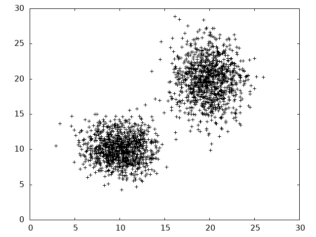|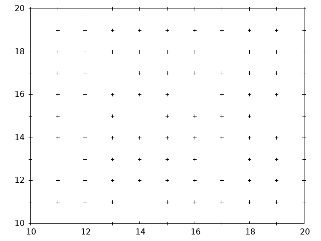|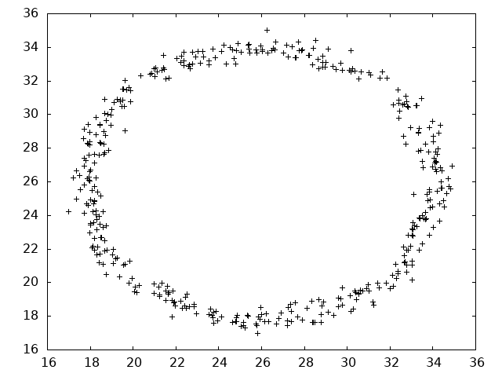|

### Used Commands

Anomaly maps are generated by running the following set of commands (using circle as an example) inside the [test](../test) directory:

    ceif -l circle.csv -T1 -O0s -p "%d,0x%x,%s" -o plot_data.csv -t200
    gnuplot plot.gp

This generates an anomaly score map in `pic.png`. Command breakdown:

* `ceif`: Run `ceif` using `circle.csv` as training data. All points having an anomaly score greater than or equal to 0 are written to `plot_data.csv` using format `"%d,0x%x,%s"`. Parameters used:
    * `-l`: Use `circle.csv` as training data.
    * `-T1`: Generate a test dataset map; a value of 1 doubles the map area compared to the training data.
    * `-O0s`: An anomaly score threshold of 0 is used in test generation, printing all evaluated points.
    * `-p "%d,0x%x,%s"`: Print test data using printf-style formatting.
    * `-o plot_data.csv`: Write test map to `plot_data.csv`.
    * `-t200`: Build 200 trees to ensure smooth path length averaging.
* `gnuplot`: Render the score heatmap from `plot_data.csv`.

    
### Results

#### Extended Isolation Forest with Revised Algorithm
The following table presents score heatmaps across thresholds between 0 and 0.6s (scaled). 
Training samples are shown in black. Outlier regions are displayed in color (green to red gradient), while inlier regions are white.

|Outlier score value (-O)|Two blobs|Square|Circle|
|---|---|---|---|
|training data||||
|0|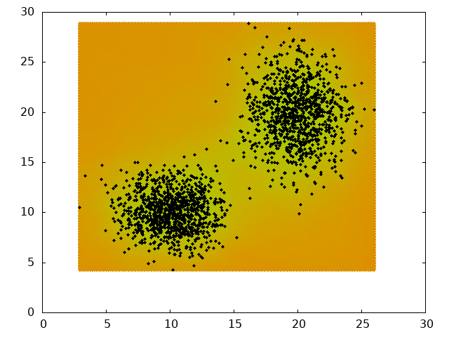|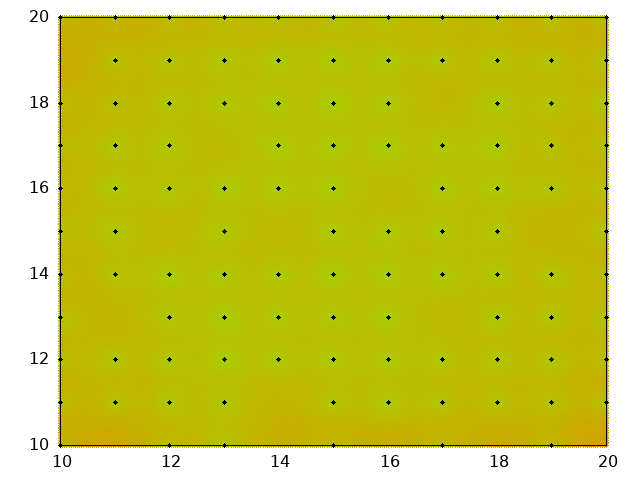|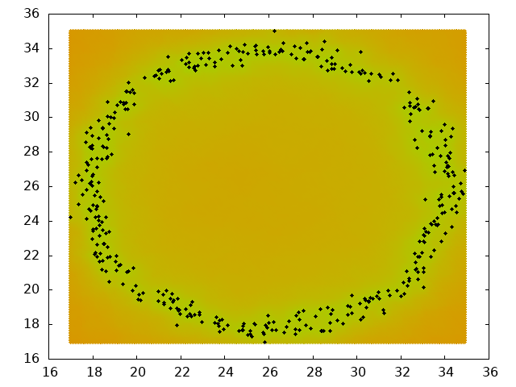|
|0.35s|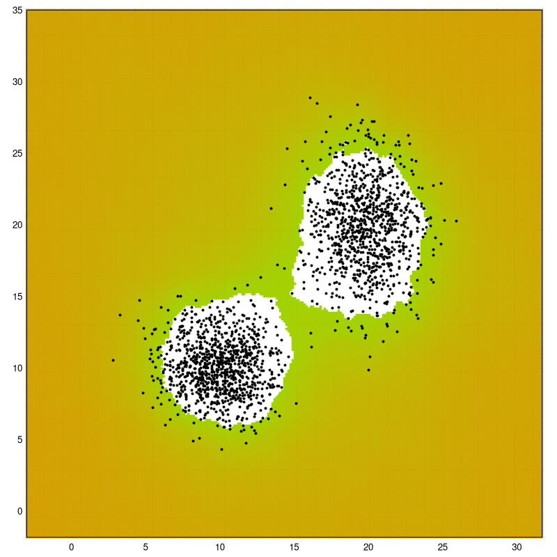|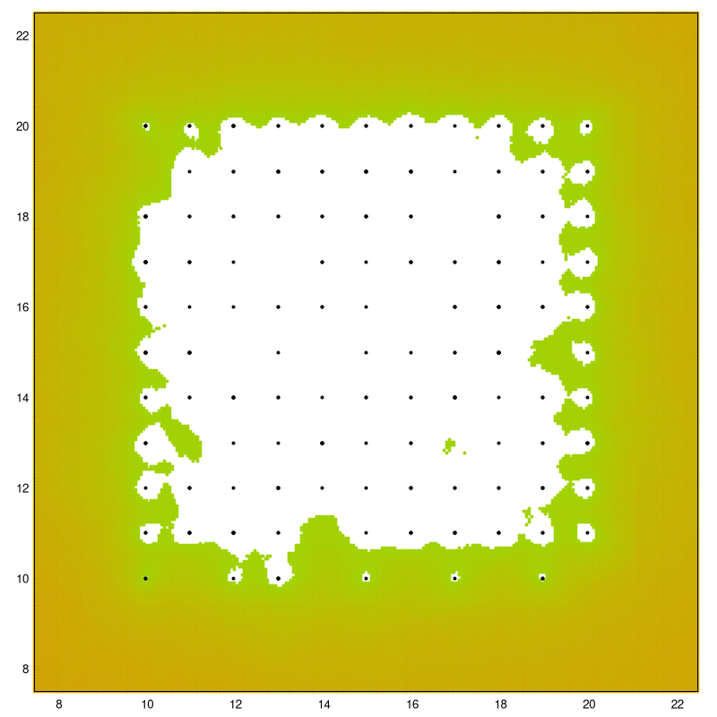||
|0.5s|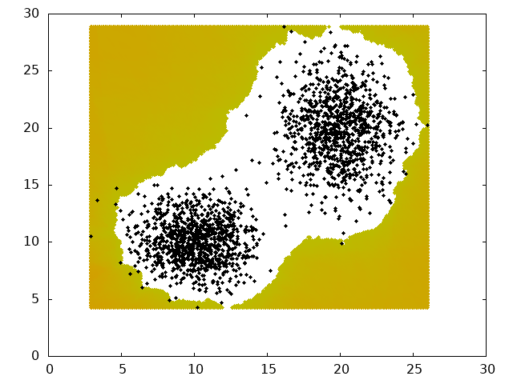|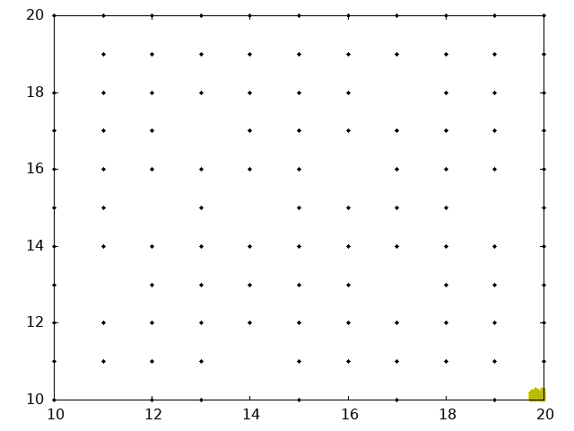|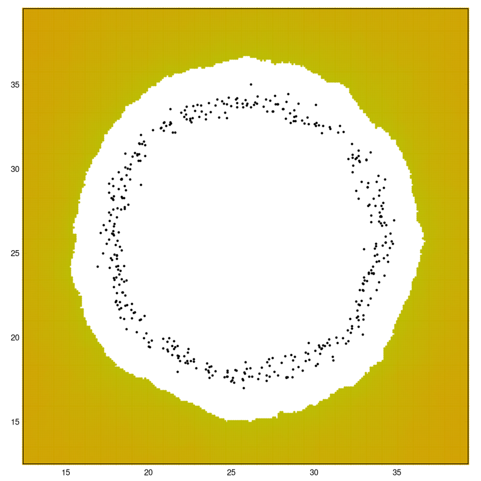|
|0.6s|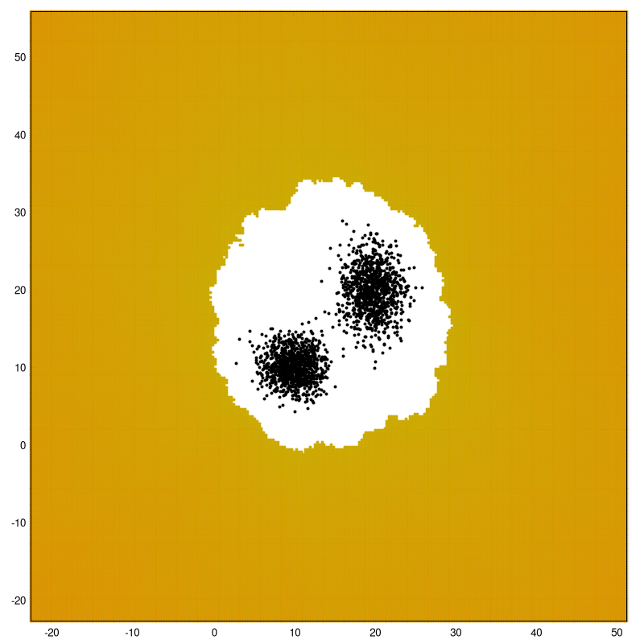|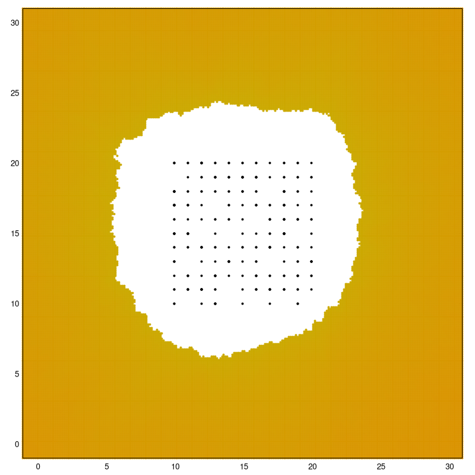|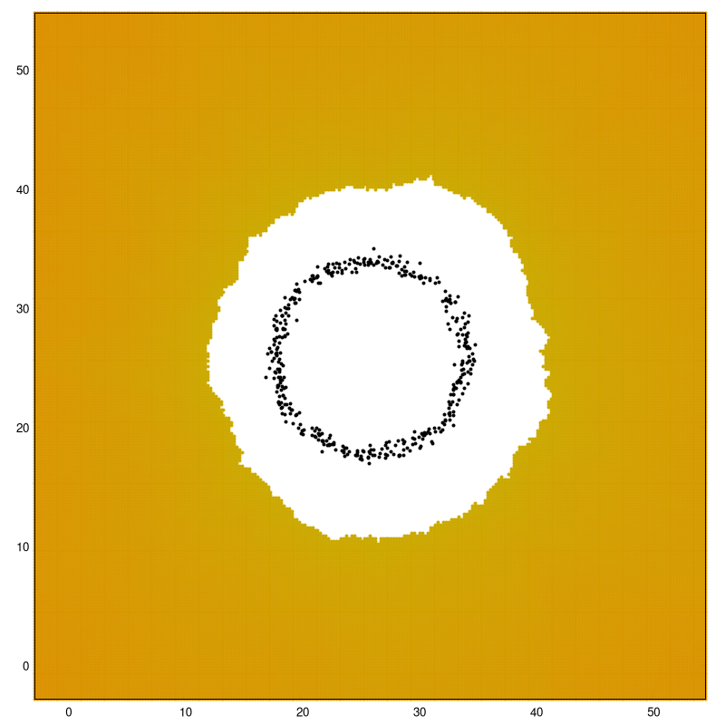|

A scaled score threshold of `0.35s` provides sensitive outlier detection, highlighting subtle edge deviations and peripheral observations.

The `0.5s` threshold serves as a balanced baseline boundary for general anomaly detection across typical distributions.

The `0.6s` threshold is optimal for capturing definitive outliers. While higher thresholds like `0.65s` can place the decision boundary too far into empty space away from the data, `0.6s` isolates clear anomalies with high precision while preserving tight boundary fidelity.

#### Scaled Outlier Score
When suffix 's' is appended to the outlier score, analyzed scores are scaled to the range $0.0 \dots 1.0$:

$$
s_{\text{scaled}} = \frac{s - s_{\min}}{s_{\max} - s_{\min}}
$$

This normalization anchors the best inliers near 0.0 and distant anomalies near 1.0, ensuring consistent operational thresholds across disparate forests. Scaling is always enabled during categorization (option -c). Scaling is not applied when a percentage-based score (`%`) is used.


##### Structural "Zero Kelvin" Calibration ($s_{\min}$)
Rather than relying on an empirical loop over training samples (which is subject to sample order variance and reservoir outliers), `ceif` calibrates $s_{\min}$ analytically using the **Zero Kelvin principle**:

`ceif` traverses all trees in memory via `tree_find_max_height()`, locating the theoretical deepest leaf:

$$
H_{\text{leaf}} = \text{depth} + c\left(\frac{\text{sample-count}}{d_0}\right)
$$

where $d_0 = 0.05$ (`MIN_REL_DIST`) represents the theoretical maximum density when a query point lands directly on top of a sample point in that leaf.

It averages the maximum theoretical heights across all trees:

$$
\bar{H}_{\text{zero-kelvin}} = \frac{1}{T}\sum_{t=0}^{T-1} H_{\max}(t)
$$

The baseline minimum score is calibrated directly:

$$
s_{\min} = \frac{1}{2^{\bar{H}_{\text{zero-kelvin}} / c}}
$$

This structural lower bound is computed in microseconds and guarantees consistent inlier headroom across all categories.

##### Asymptotic Exponential Outer Limit ($s_{\max}$)
Classic EIF hyperplanes extend infinitely, causing severe starburst rays where points far outside the distribution receive low anomaly scores. `ceif` eliminates this behavior and sets the maximum score directly to $s_{\max} = 1.0$:

When a point falls outside the training data bounding envelope ($[\min_j, \max_j]$), its normalized Euclidean exterior distance is evaluated:

$$
d = \sqrt{\sum_{j=1}^D \left(\frac{\max(0, \min_j - x_j) + \max(0, x_j - \max_j)}{\text{span}_j}\right)^2}
$$

where $\text{span}_j = \max_j - \min_j$ represents the empirical coordinate span of the training data along dimension $j$. Dividing by $\text{span}_j$ normalizes exterior displacements relative to each feature's natural scale, making the distance metric scale-invariant and preventing high-magnitude dimensions from skewing outer space calculations.

An asymptotic exponential decay pulls the score toward 1.0:

$$
s = 1.0 - (1.0 - s_0) \cdot e^{-\beta \cdot d}
$$

where $s_0$ is the baseline tree anomaly score and $\beta = 0.10$ (`OUTER_DECAY_RATE`).

To prevent premature numerical saturation and preserve dynamic range across deep space, scores are strictly bounded below 1.0:

$$
\text{if } (s \ge 1.0) \quad s = 1.0 - 10^{-6}
$$

Scaled scores $s_{\text{scaled}}$ are likewise bounded to $[0.0, 1.0 - 10^{-6}]$.


##### Interpretation of Scaled Score Thresholds (-O)

Scaled outlier scores normalize raw forest anomaly scores into the range $[0.0, 1.0)$ using theoretical Zero Kelvin deepest-leaf calibration ($s_{\min}$) and direct maximum bound ($s_{\max} = 1.0$). This maps queries onto a clear, scale-invariant spectrum from dense cluster centroids to deep exterior space.

When selecting an outlier threshold (`-O FLOATs`), observations with scores equal to or exceeding the threshold are flagged as anomalies. The operational behavior across key score thresholds is summarized below:

| Outlier Score (`-O`) | Spatial Zone | Interpretation & Behavior | Typical Use Case |
|---|---|---|---|
| `< 0.3s` | Deep Core Inliers | Points located in the densest regions of sample clusters and centroid neighborhoods. | High-confidence normal baseline; ideal for identifying pristine reference patterns. |
| `< 0.5s` | Nominal Inliers | Points falling within the standard operating envelope and main cluster volume. | General baseline traffic and legitimate nominal system operation. |
| `> 0.5s` | Sensitive Outlier Detection | Captures early departures, subtle edge deviations, and points along the periphery of clusters. | Early warning screening, exploratory anomaly triage, or sensitive monitoring where catching potential issues is prioritized over minimizing false alerts. |
| `> 0.6s` | Definitive Outliers | Points decisively separated from cluster bodies and manifold surfaces; clearly anomalous. | Recommended baseline operational alerting threshold. Captures unambiguous outliers with high precision, whereas higher thresholds (e.g. `0.65s`) can push the boundary too far away into empty space. |
| `> 0.9s` | Really No False Positives | Distant observations situated far outside any normal cluster or local manifold feature. | High-stakes operational alerting, automated remediation, or emergency paging where false alarms cannot be tolerated. |
| `> 0.95s – 0.99s` | Extreme Outliers | Severe spatial anomalies residing deep in the outer margins between local clusters and empty space. | Automated traffic dropping, critical sensor failure detection, and tamper detection. |
| `> 0.999s` | Deep Outer Space | Points far beyond the empirical training bounding envelope ($[\min_j, \max_j]$). | Domain perimeter enforcement. Driven by asymptotic exponential decay ($\beta = 0.10$), creating a solid, gap-free convex boundary. |

##### Operational Guidance

* **`< 0.3s` (Deep Core Inliers):** Identifies points that represent the truest central tendency of the training distribution.
* **`< 0.5s` (Nominal Inliers):** Represents the default volume of typical cluster points.
* **`> 0.5s` (Sensitive Outlier Detection):** Useful when false negatives are expensive. Flags subtle departures, transitional states, and cluster edge bleed before they become severe anomalies.
* **`> 0.6s` (Definitive Outliers):** The recommended production baseline for definitive anomaly alerting. Outliers at this level are unambiguous and distinct from nominal cluster noise without pushing the boundary too far into empty space (as can occur with `0.65s`).
* **`> 0.9s` (Really No False Positives):** Reserved for actions requiring near-certainty. Guarantees that only extreme, unquestionable anomalies trigger intervention.

##### Example: Inspecting Anomalies Across Threshold Regimes

In wide-area evaluations (such as spatial test generation with `-T`), varying the scaled threshold illustrates the progression from sensitive cluster hulls to the outer universe:

```bash
# Sensitive boundary detection around sample clusters:
ceif -l complex2d.csv -T3.0 -i 256 -O 0.5s -p "%d,0x%x,%s" -o plot_05s.csv

# Standard definitive outlier detection (production default):
ceif -l complex2d.csv -T3.0 -i 256 -O 0.6s -p "%d,0x%x,%s" -o plot_06s.csv

# High-confidence alerting (really no false positives):
ceif -l complex2d.csv -T3.0 -i 256 -O 0.9s -p "%d,0x%x,%s" -o plot_09s.csv

# Deep-space domain perimeter (completely solid convex envelope):
ceif -l complex2d.csv -T20.0 -i 256 -O 0.999s -t 200 -p "%d,0x%x,%s" -o plot_999s.csv
```


#### Percentage-Based Outlier Score
A percentage-based threshold (`-O x%`) sorts all sample scores and selects the value covering $x$ percent of the training distribution. 
For example, a 50% score corresponds to the median sample score, while 100% represents the maximum sample score.

Percentage scores are particularly useful for identifying distribution shift or bias: if the threshold is set to $x$ percent, stationary test data should exhibit approximately $x$ percent inliers. If inlier counts deviate significantly, the evaluated dataset may have experienced distribution drift. The `-v` option prints these summary statistics.

#### Novelty Detection and Pure-Inlier Modeling
While CEIF typically operates as an unsupervised outlier detector on potentially contaminated data, it can also be configured for **novelty detection** (one-class classification) when the training dataset is assumed to consist exclusively of clean, valid inliers:

- **Deterministic Boundary with `-O 100%`**: By specifying `-O 100%`, CEIF sets the anomaly threshold to the maximum score observed among all training samples ($s_{\max}^{\text{train}}$). Because samples are flagged only when $\text{score} > s_{\max}^{\text{train}}$, exactly 0% of the clean training samples are marked as anomalies (guaranteed zero false alarms on known normal behavior), while any unseen observation outside this envelope is rejected. On very large datasets, a slightly softer boundary such as `-O 99.9%` or `-O 99.5%` can be used to accommodate edge-case variance.
- **Omit Outlier Pruning (`-k`)**: In unsupervised mode, `-k` prunes extreme samples under the suspicion that they are noise. When training on pure inliers, omit `-k`; the outer training points represent legitimate boundary extents of normal behavior and are essential for defining the true envelope.
- **Smooth the Envelope with Higher Tree Counts (`-t 200`)**: Increasing tree count (e.g., `-t 200`) reduces the variance of path lengths, producing smoother, more continuous decision boundaries around the inlier manifold.
- **Multi-Mode Inlier Envelopes (`-C` and `-c`)**: If normal behavior spans multiple operating regimes (e.g., distinct machine states or operational modes), grouping them with `-C` trains an independent clean envelope per category. During inference, `-c -O 100%` flags any point that fails to fit within *at least one* of the known valid envelopes.

#### Population Drift Analysis Using 80% Score
While novelty detection (`-O 100%`) evaluates individual observations against a zero-false-alarm envelope, CEIF can also monitor continuous telemetry streams for **population drift** (distribution shift) across cohorts of observations using an 80th-percentile score threshold (`-O 80%`):

- **Calibrate the Baseline Envelope (`-O 80%`)**: When training a baseline model, specifying `-O 80%` sorts all sample anomaly scores and establishes the threshold at the 80th percentile ($P_{80}$). Under stationary conditions, exactly 80% of normal samples fall below this boundary, while the outer tail contains the remaining 20%:

$$
\frac{N_{\text{tail}}}{N_{\text{total}}} = 1.0 - 0.80 = 0.20
$$

- **Why 80% Outperforms Extreme Percentiles for Drift Detection**: Extreme percentiles (such as 99% or 99.9%) yield very sparse outlier counts (1% or 0.1%), causing high Poisson noise and erratic alarm rates on small-to-medium evaluation batches. In contrast, monitoring the upper 20% tail provides a substantial statistical sample size ($N_{\text{tail}} = 200$ points per 1,000 observations). This grants high statistical power to detect subtle, gradual distribution drift—such as sensor calibration aging, changing user behavior, or environmental shifts—long before observations reach extreme outlier status.
- **Monitoring Batch Telemetry with Option `-v`**: Periodic batches (e.g., daily or hourly telemetry) can be evaluated against the saved baseline using summary formatting:

  ```bash
  # Train and save the reference baseline with an 80% threshold:
  ceif -l baseline.csv -O 80% -w baseline.ceif

  # Evaluate an incoming batch and report summary metrics:
  ceif -r baseline.ceif -a daily_batch.csv -p "" -v "%r %h %s %S"
  ```

- **Quantifying Drift from Summary Metrics**:
  - **Tail Exceedance Ratio (`%h / %r`)**: In a stable, stationary population, the ratio of points exceeding the threshold (`%h / %r`) closely tracks $0.20$ (20%). If this ratio drifts upward to $0.28$ or $0.35$, the incoming population has expanded or shifted away from the reference cluster centroids. Conversely, a sharp drop below $0.15$ indicates population contraction or sampling bias.
  - **Mean Anomaly Score (`%S`)**: Comparing the batch average score (`%S`) against the training baseline average provides a global metric of distribution shift independent of threshold boundaries.
- **Triggering Automated Model Retraining**: When the tail exceedance ratio or mean score systematically exceeds statistical tolerance bounds across consecutive monitoring windows, the pipeline can automatically trigger retraining or update the reservoir via `-z` or `-r ... -w ...`.

#### Complex Topologies
Nested non-convex shapes, such as concentric circles and complex synthetic topologies, present challenges because random hyperplanes can easily bridge across separated inlier and outlier bands. 
Here, the nearest training point distance adjustment (`NEAREST 1`, default) is critical to resolve voids, narrow channels, and fine boundaries:

| Case | Two circles | Complex |
|---|---|---|
|Data map|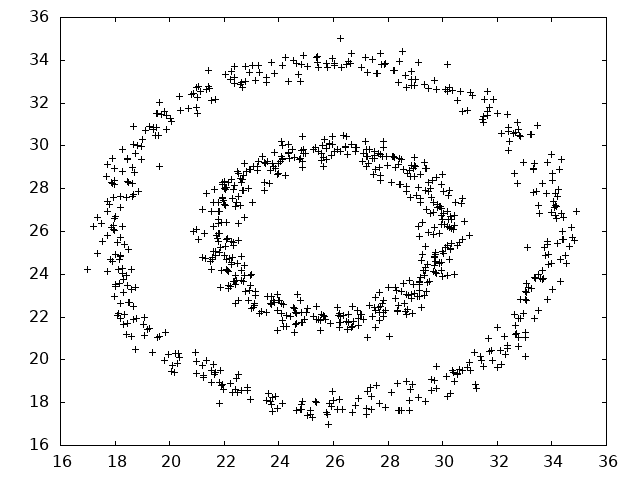|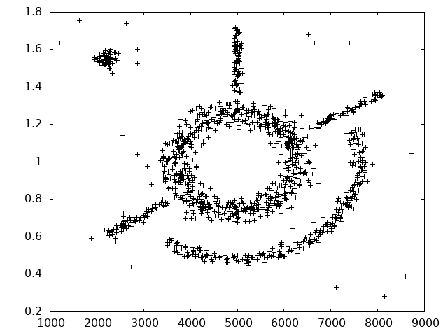|
|-O 0s and NEAREST 0|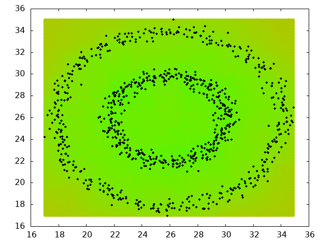|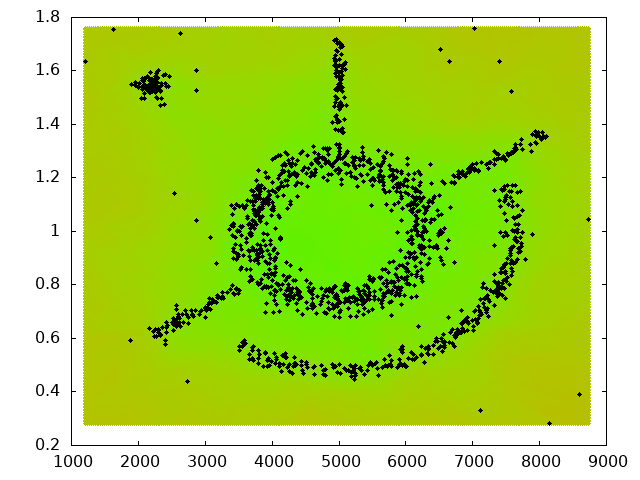|
|-O 0s and NEAREST 1|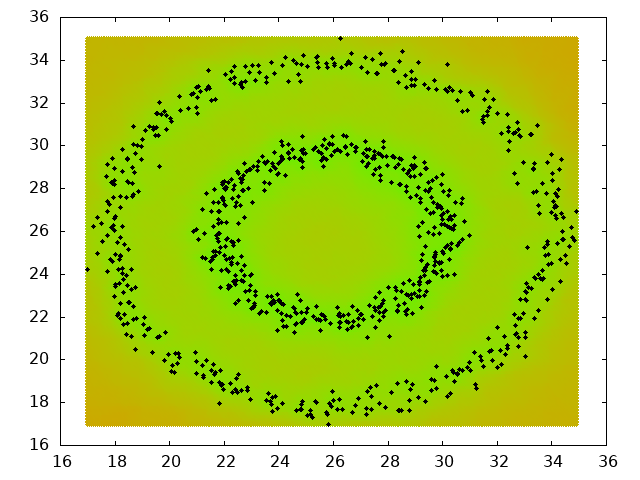|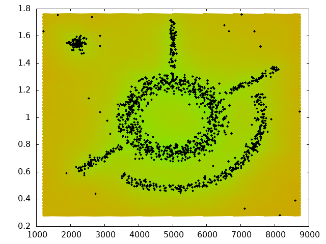|
|-O 0.33s and NEAREST 0|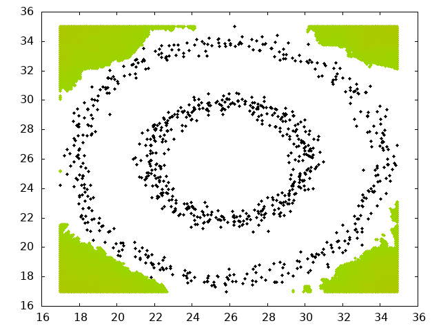|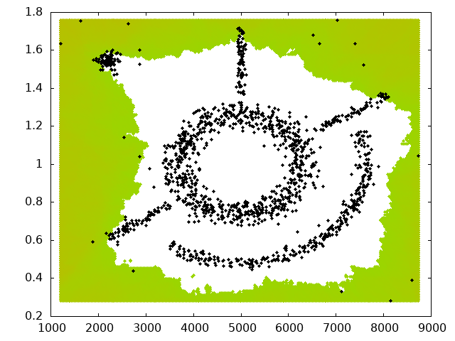|
|-O 0.33s and NEAREST 1|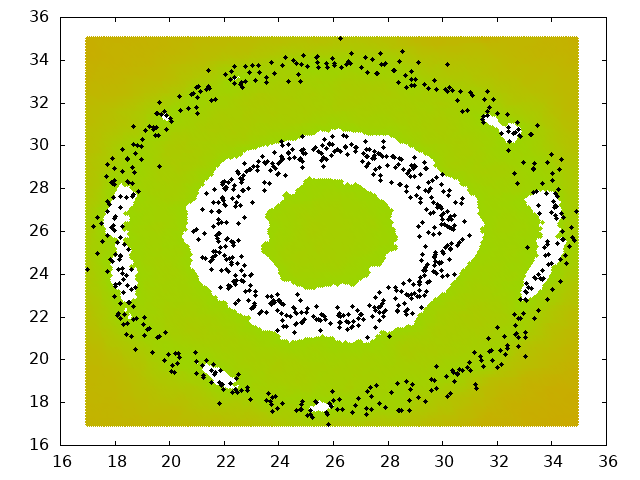|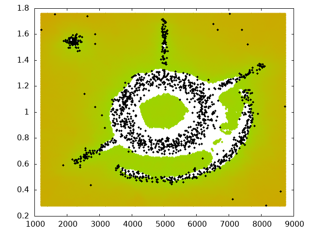|

Without nearest-point distance weighting (`NEAREST 0`), isolating internal voids and gaps between separate structures is difficult—hyperplanes span across empty space, incorrectly grouping distinct components into a single connected inlier mass. Even with a score threshold of `0.33s`, `NEAREST 0` fails to carve out the interior gap between concentric rings and the void within the complex shape.

With `NEAREST 1`, a score of `0.33s` provides sensitive outlier detection: the spaces between concentric rings and the internal cavities and canals of complex shapes are cleanly identified as outlier zones, while the white inlier envelope tightly and accurately hugs the actual sample points. The trade-off is a slight increase in evaluation time.

### Saving and Updating Forest Data
The result of the training phase can be saved to a file for later inference, and iteratively updated with new training batches. 
In the following example, a square model is updated with a smaller secondary blob:

| Case | File | Map |
|---|---|---|
|Square|square.csv||
|Small blob|sblob.csv|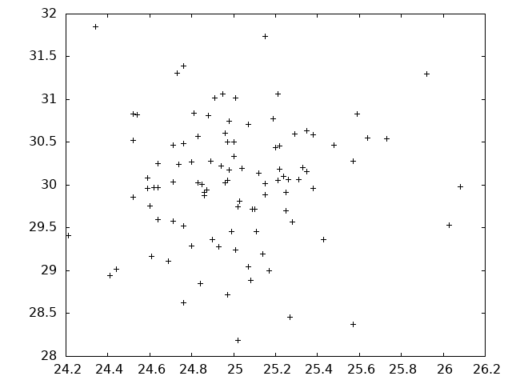|

Training and saving the square to `square.ceif`:

    ceif -l square.csv -w square.ceif 

Updating `square.ceif` with the secondary blob:

    ceif -r square.ceif -l sblob.csv -w square.ceif

Creating the anomaly map with commands:

    ceif -r square.ceif -T1 -O0s -p "%d,0x%x,%s" -o plot_data.csv   
    gnuplot plot.gp


Resulting map in pic.png, inlier area is green:

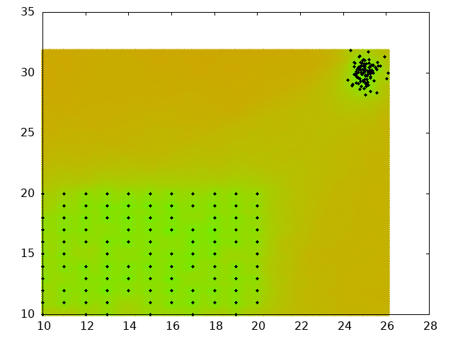

#### Continuous Rolling Updates and Automatic Reservoir Ceiling
When updating an existing forest with new batches of telemetry (via `-r ... -w ...` or in-place `-z`), `ceif` maintains sample diversity using reservoir sampling:
- Once the forest has accumulated its target sample capacity ($S = \text{samples}$), each new incoming row is accepted into the reservoir with probability $P = \frac{S}{S + N_{\text{extra}}}$.
- When an incoming point is accepted, it replaces a uniformly chosen random existing sample in the reservoir, and the trees are rebuilt.

**The Long-Running Model Dilemma & Automatic Ceiling:**  
In continuous monitoring deployments running for months or years without manual housekeeping, `extra_rows` would grow into the millions. Under standard reservoir sampling, this causes the acceptance probability to decay asymptotically toward zero ($P \to 0$), permanently locking in ancient baseline history and blinding the model to legitimate environmental evolution.

To resolve this without requiring manual intervention, `ceif` enforces an **automatic reservoir ceiling**:

$$
N_{\text{extra}} \le \text{samples} \times 3
$$

where `EXTRA_ROWS_FACTOR = 3`. This bounds the denominator so that:

$$
P_{\min} = \frac{S}{S + 3S} = \frac{1}{4} = 0.25
$$


The acceptance chance for new incoming data never drops below **25%** (approximately 1 in 4 rows). As new observations arrive, the reservoir continually rolls forward, adapting to gradual long-term trends while remaining resilient to transient noise spikes.

You can inspect the state of a model's reservoir using `-q`:
```text
$ ceif -r traffic.ceif -q
...
Forest data:
  Forest category string: 'default'
    Number of samples: 256
    Extra rows evaluated: 768 (automatic ceiling reached)
    New sample acceptance chance: 25.0% (approx. 1 in 4.0 rows)
```

Legacy model files loaded with larger accumulated `extra_rows` counts are automatically clamped to this ceiling upon load.

### Performance
Here are benchmark runs using `covtype.data` from the [UC Irvine Machine Learning Repository](https://archive.ics.uci.edu/ml/datasets/covertype). The file contains 55 columns and 581,012 rows.
Tests were run on an Intel i5-650 Processor (3.20 GHz, 8 GB RAM).

#### Learn with Category
The first 10 fields are used in analysis, and field 55 serves as the category key. Forest data is written to a file:

    time ceif -w covtype.f1 -l covtype.data -I1-100 -U1-10 -C55

    real    0m1,122s
    user    0m1,077s
    sys     0m0,044s

#### Analyze Using Forest Data from Previous Run
Outlier score threshold 0.9 is used to suppress printing:

    time ceif -r covtype.f1 -a covtype.data -O0.9
    
    real    0m16,504s
    user    0m16,442s
    sys     0m0,048s

#### Categorizing Data
Categorizing takes more time because each analyzed row must be evaluated against every category's forest:

    time ceif -r covtype.f1 -c covtype.data -p "%c %C %v" -o /dev/null
    
    real    1m52,876s
    user    1m52,340s
    sys     0m0,240s

### Generating Test Datasets with Option -T
Option -T can be used to generate a test dataset around sample points. Spatial span and sample density can be customized. By default, test data spans the same range as the training data with 256 test points per dimension.

In this example, `2blob.csv` is used for training, and test data is generated with a range adjustment factor of 1 (approximately doubling the bounding area). For each dimension attribute, 512 test values are generated (yielding $512 \times 512 = 262,144$ total test points). Only points with an anomaly score of 0.6 or higher are written to `plot_data.csv`:

    ceif -l 2blob.csv -T1 -i 512 -O 0.6 -p "%d,0x%x" -o plot_data.csv

The resulting `plot_data.csv` contains rows such as:
    
    -8.655000,-7.965000,0x8B7300
    10.031602,-7.485508,0x807E00
    14.003633,37.394961,0x768800

The output file can be plotted with gnuplot. Points with scores below 0.6 are left uncolored. Original training samples (up to 10,240 points) are plotted in black:

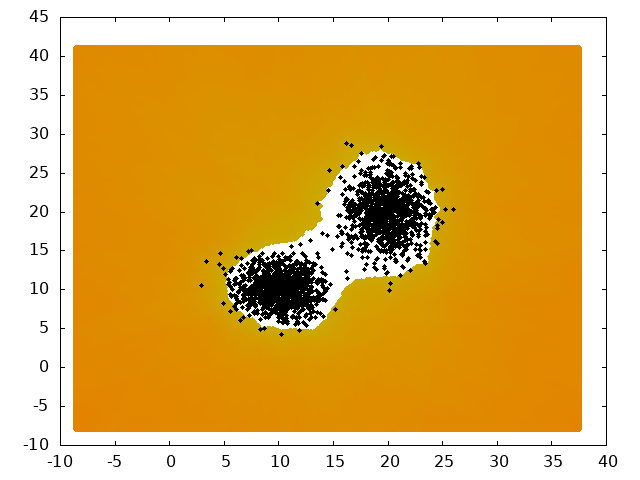

### Scaling Dimension Values Across Differing Attribute Magnitudes
#### Without Scaling
If training datasets feature dimensions with vastly different value ranges, standard dot products cause attributes with smaller numerical magnitudes to lose their influence on splits.
By default, `ceif` normalizes dimension scales automatically; this can be disabled via the rc-file setting `AUTO_SCALE 0`.

In this example, an elongated dataset is evaluated with two attributes spanning ranges 5–117 and 100,000–2,000,000. The second attribute has much larger absolute values.
If a test dataset is generated without dimension scaling (`AUTO_SCALE 0`), the X attribute has virtually no discriminative influence:

    ceif -l Wtest.csv -T3 -p "%d,0x%x" -o plot_data.csv -O0.6s

Points with scores of 0.6s or greater are plotted:

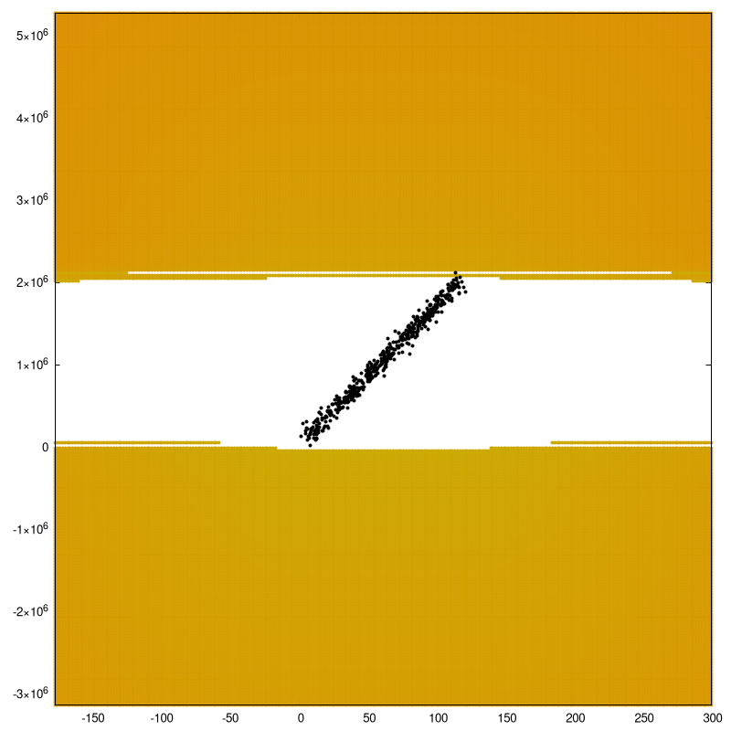

The entire horizontal band across the X-axis is treated as having scores below 0.6s (displayed in white), which is not the desired behavior.

#### Running with Scaling
Running again with automatic dimension scaling enabled (`AUTO_SCALE 1`, default behavior):

    ceif -l Wtest.csv -T3 -p "%d,0x%x" -o plot_data.csv -O0.6s 

The anomaly boundary cleanly and tightly outlines the linear cluster:

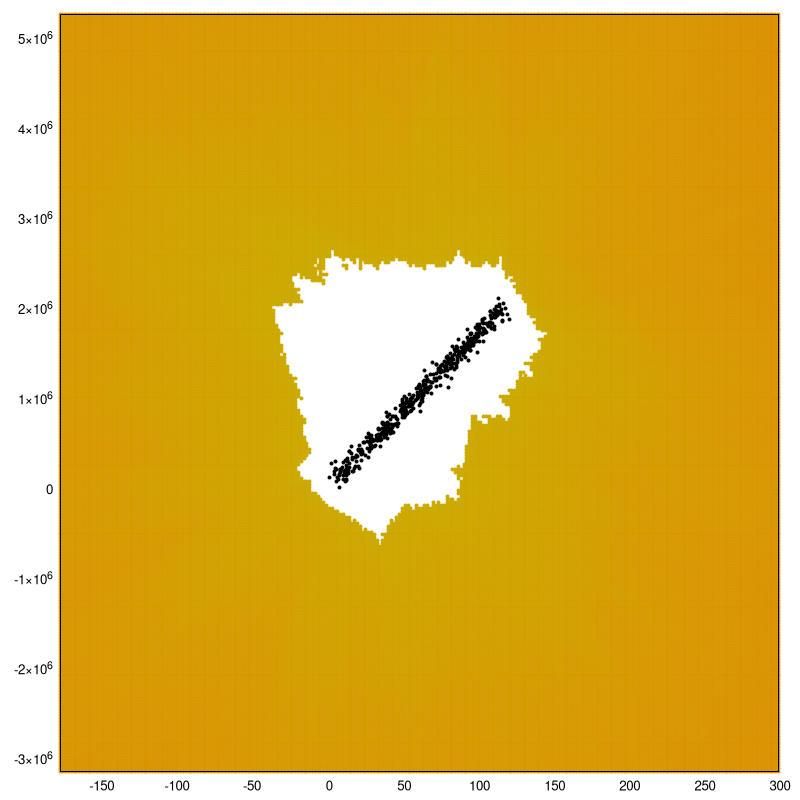

Values are normalized relative to the largest attribute range, ensuring both attributes contribute equally to hyperplane projections.

### Summary Statistics for Analyzed Data
Option -v prints summary statistics calculated from analyzed data (-a). When specified, `ceif` computes total rows evaluated and the number of rows exceeding the outlier threshold. Option -v accepts a format string supporting the following directives:

| Directive | Meaning |
|----|----|
| %r | Number of analyzed rows|
| %s | Anomaly score threshold|
| %S | Average anomaly score across dataset|
| %h | Number of rows exceeding outlier threshold|

Example using `2blob.csv`:

    ceif -l 2blob.csv -O90% -w 2blob.ceif
    ceif -r 2blob.ceif -a 2blob.csv -p "" -v "%r %h %s %S"
    2000 200 0.373435 0.319595

The training dataset is saved to `2blob.ceif` with a 90th-percentile threshold. The file is then analyzed against the trained model. Summary statistics are printed with option -v, while per-row output is suppressed with `-p ""`. Output breakdown:

- 2000: Total number of input lines
- 200: Number of lines having scores higher than 90% of training data (expected: $2000 \times 0.10 = 200$)
- 0.373435: Percentile-based anomaly score threshold
- 0.319595: Average test dataset score

This is useful for monitoring batch distributions. If %h deviates significantly from the expected count (here 10%), the analyzed dataset may exhibit distribution shift.

### How to Categorize
`ceif` can classify data across multiple categories. Each input row is evaluated against all category forests; the forest yielding the lowest anomaly score represents the best category match.
When a scaled score threshold (-O) is provided, classifications are filtered: the category with the lowest score is accepted only if its score is below the threshold.

The following examples use training data from [3cat\_samples.csv](../test/3cat_samples.csv), which contains 2-dimensional features (fields 1-2) and a category key (field 3):

Training data distribution:

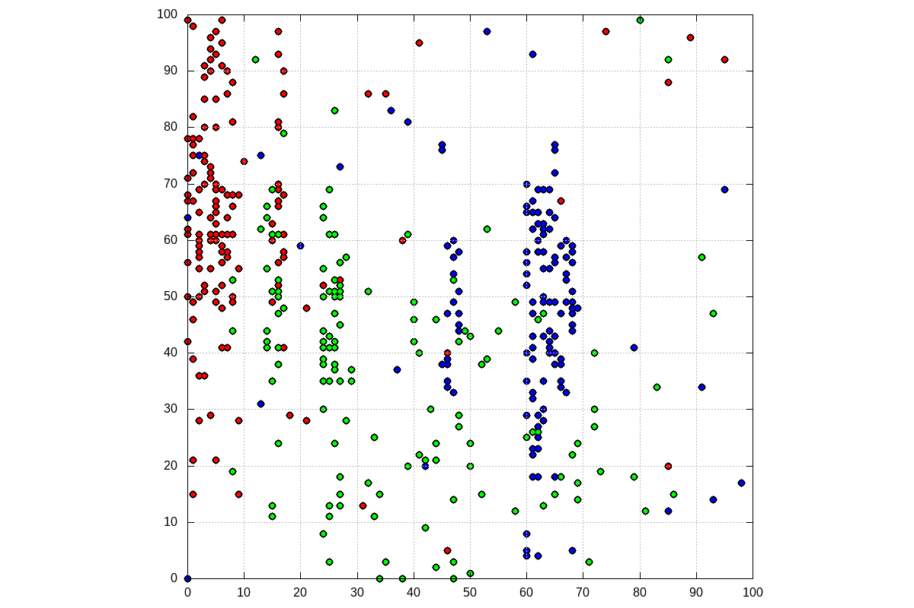

Category keys are RGB strings (`red`, `green`, `blue`). Classification is evaluated using [3cat\_test.csv](../test/3cat_test.csv) ($100 \times 100$ grid points) where category values are unknown (`X`).

Training and saving the multi-category model:

    ceif -l 3cat_samples.csv -C3 -d0 -w 3cat.ceif

Evaluating classifications with a scaled threshold of 0.5s:

    ceif -r 3cat.ceif -c 3cat_test.csv -p "%d,%C" -O0.5s -o plot_data.csv

Category value maps across configurations:

|Outlier score / NEAREST setting|NEAREST 1|NEAREST 0|
|---|---|---|
|No outlier score given|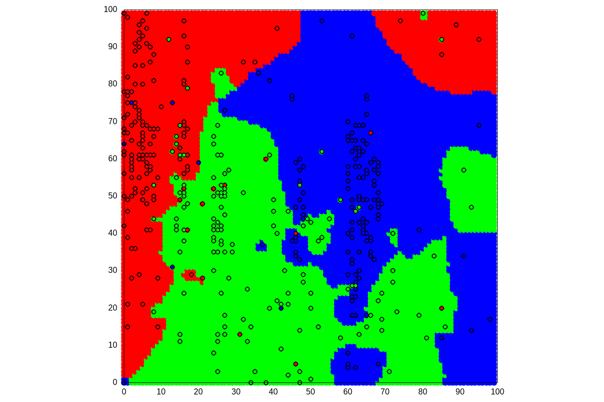|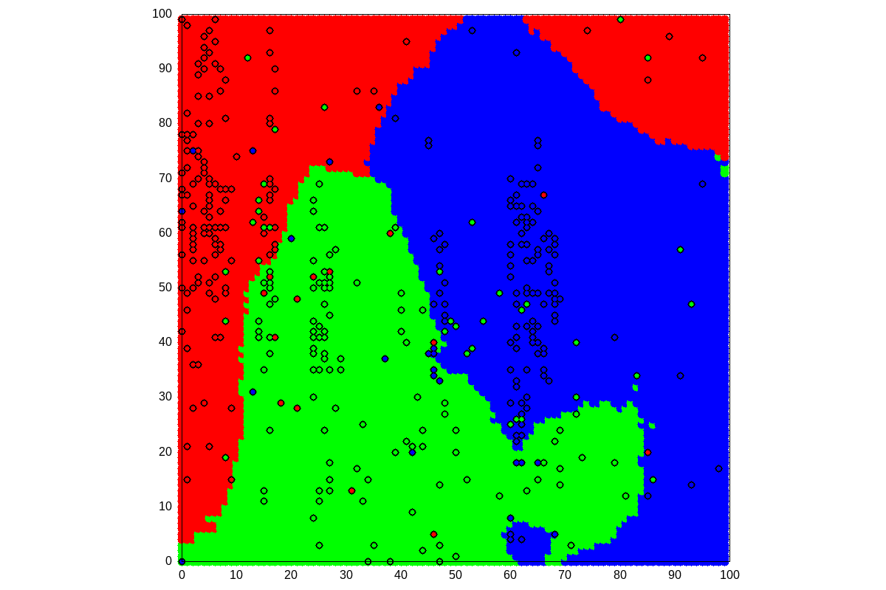|
|0.5s|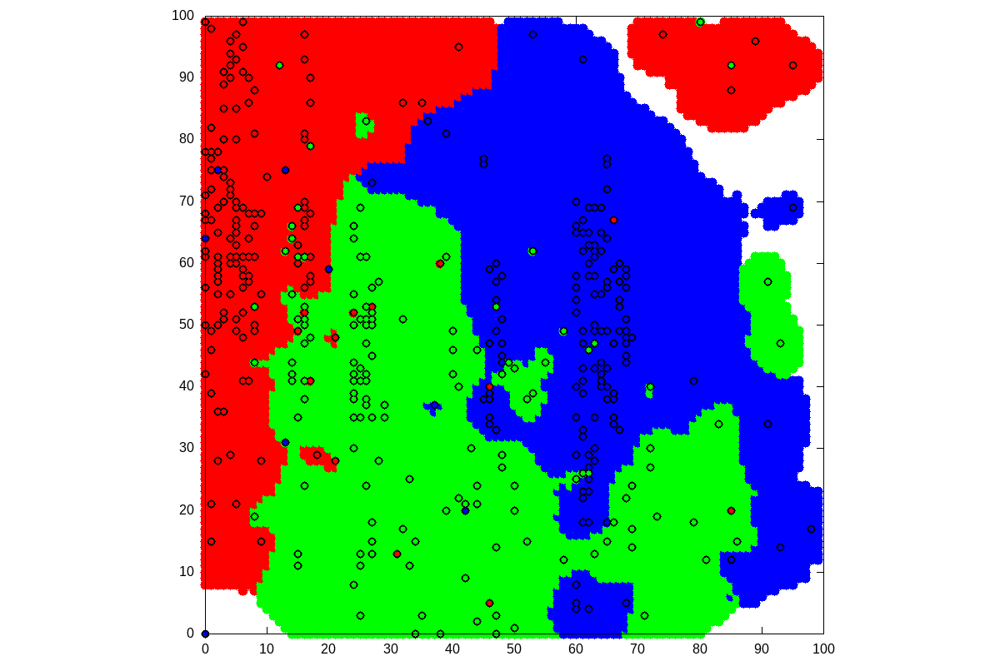|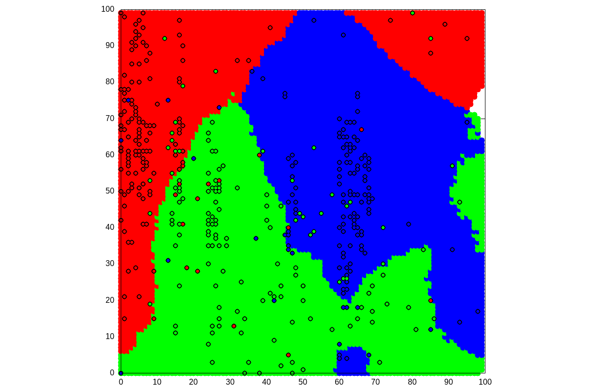|
|0.3s|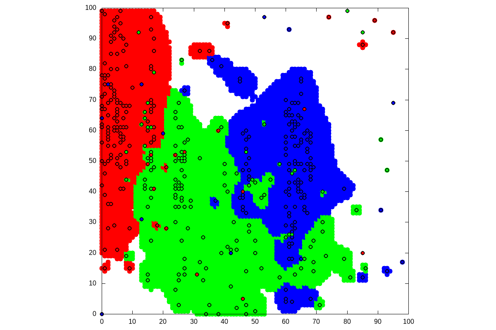|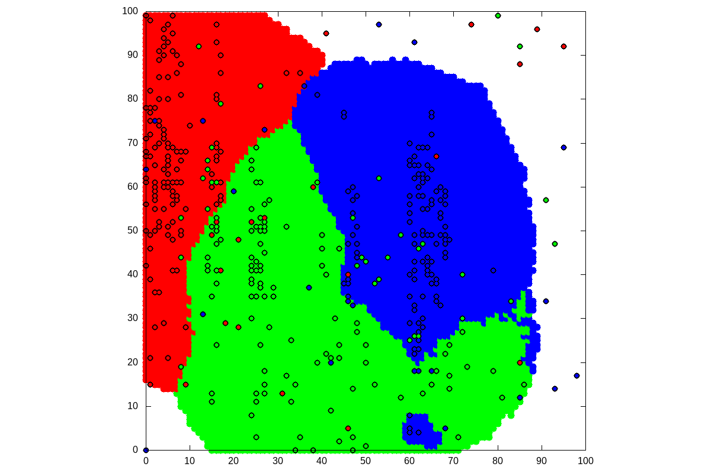|

Key observations:
- `NEAREST 1` provides sharper, more accurate classification boundaries between categories.
- Lower outlier thresholds leave ambiguous boundary regions unassigned (white areas).

An MP4 animation illustrating classifications as the threshold decreases from 0.99 to 0.0 in increments of 0.01:
https://user-images.githubusercontent.com/50619541/126327929-b68fc5e0-c229-4c61-aa10-a79a87ebd19b.mp4

### Sampling Large Datasets
For massive datasets where approximate sampling is acceptable, the configuration variable `ANALYZE_SAMPLING` reduces processing time.
`ANALYZE_SAMPLING` defines the baseline number of rows evaluated before streaming reservoir sampling activates.

Estimated analyzed row count:

    k * (ln(x/k) + 1)

Where:
    k = ANALYZE_SAMPLING setting
    x = Total input row count

Approximate rows evaluated when `ANALYZE_SAMPLING` is set to 10,000:

|Total Input Rows|Rows Evaluated (`ANALYZE_SAMPLING 10000`)|
|---|---|
|50,000|26,094|
|500,000|49,120|
|2,000,000|62,983|
|20,000,000|86,009|

### Grouped Dimension Attribute Metrics
Option -j (or rc-file setting `PRINT_DIMENSION`) allows dimension metrics to be grouped and formatted together (e.g., in XML format).
First, build a model from `2blob.csv`:

    ceif -l 2blob.csv -w 2blob.ceif

Analyze `sblob.csv` against `2blob.ceif`, outputting XML-structured anomaly reports:
<pre>
    cat sblob.csv | ../src/ceif -r 2blob.ceif -O0.674s -a - -j " &lt;attr idx=%i&gt;\n  &lt;value&gt;%d&lt;/value&gt;\n  &lt;score&gt;%e&lt;/score&gt;\n &lt;/attr&gt;\n" -p "&lt;outlier score=%s row=%n&gt;\n%m&lt;/outlier&gt;" -e ""
    &lt;outlier score=0.675003 row=7&gt;
     &lt;attr idx=1&gt;
      &lt;value&gt;24.760000&lt;/value&gt;
      &lt;score&gt;0.260190&lt;/score&gt;
     &lt;/attr&gt;
     &lt;attr idx=2&gt;
      &lt;value&gt;31.390000&lt;/value&gt;
      &lt;score&gt;0.621133&lt;/score&gt;
     &lt;/attr&gt;
   &lt;/outlier&gt;
   &lt;outlier score=0.674121 row=13&gt;
    &lt;attr idx=1&gt;
     &lt;value&gt;24.340000&lt;/value&gt;
     &lt;score&gt;0.207147&lt;/score&gt;
    &lt;/attr&gt;
    &lt;attr idx=2&gt;
     &lt;value&gt;31.850000&lt;/value&gt;
     &lt;score&gt;0.642780&lt;/score&gt;
    &lt;/attr&gt;
   &lt;/outlier&gt;
</pre>

### Clusters and Dimension Attribute Scores
#### Clusters
`ceif` discovers spherical data clusters within sample distributions. Cluster radius is controlled by the rc-file variable `CLUSTER_SIZE`. Clusters are non-overlapping.

Clustering procedure:
1. Base cluster radius is the distance from the sample with the lowest score to the most distant sample, multiplied by `CLUSTER_SIZE`.
2. Select the sample with the lowest score as the initial cluster center.
3. Identify all samples within the cluster radius of this center.
4. From the remaining unassigned samples, choose the one with the lowest score as the next cluster center.
5. Repeat until all samples are evaluated.
6. Prune sparse clusters with negligible sample membership.

#### Dimension Attribute Contributions
When evaluating an outlier, determining which individual attributes drove the anomaly is critical. Standard isolation forests only provide an aggregate record score.
`ceif` uses discovered cluster centers to estimate attribute importance by substituting each candidate attribute value into cluster centroids.
The resulting lowest score is reported as the dimension attribute score (printable with `%e`).

