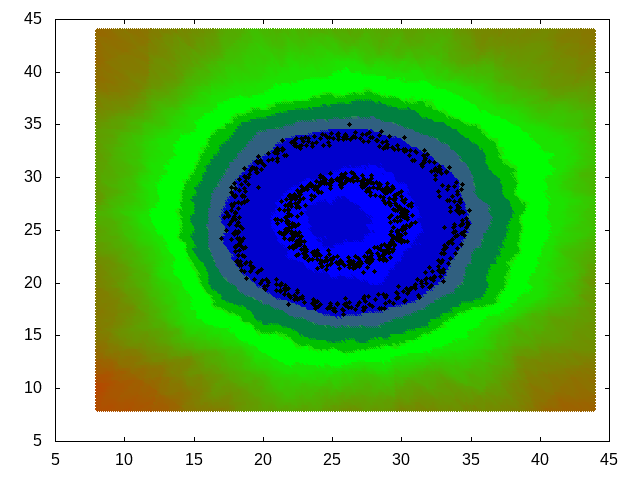

## Tweaking and testing ceif

Here are some examples generated by running ceif. Examples are 2-dimensional datasets presented in anomaly score maps. 
Examples show how some ceif parameters can be used to change the behaviour of forest training.

### Data samples

Three different datasets are used in this document: two blobs, square and circle:

|Two blobs|Square|Circle|
|---|---|---|
||||

### Used commands

Anomaly maps are generated by running following set of commands (here is the circle as an example). Commands are run in [test](../test) directory:

    ceif -l circle.csv -T1 -Omax -p "%d,0x%x,%s" -o plot_data.csv
    gnuplot plot.gp

Now you have the anomaly score map in file 'pic.png'. Commands explained:

* ceif: Run ceif by using file circle.csv as training data. All points having anomaly score larger or equal than 0 are written to file plot\_data.csv using "%v,0x%x,%s" as printing format. See manual for more about ceif parameters.  Parameters used here:
    * -l: use file circle.csv as training data
    * -T1: generate test data map, value 1 gives one time larger map compared to training data
    * -O0: anomaly sore 0 is used in test data generation, effective all points are printed
    * -p "%d,0x%x,%s": print test data using printf style format
    * -o plot\_data.csv: write test map to plot\_data.csv
* gnuplot: generate score map using plot\_data.csv

    
### Results

#### Extended isolation forest with revised algorithm
Following table presents some score maps using anomaly scores 0, 0.5, 0.5s (with scaling), max and average score. 
Max score is calculated using the sample value having larges anonaly score. Average score is the sample average score adjusted by standard deviation. Sample values are printed using black.
Outlier area is printed using color and non outlier are is white.

|Outlier score value (-O)|Two blobs|Square|Circle|
|---|---|---|---|
|training data||||
|0||||
|0.5||||
|0.5s||||
|max||||
|average||||

Outlier score 0.5 is not the same for all cases. In some cases (2blobs and square) it leaves some training data points in outlier area and in circle case it is too large. 
max outlier score leaves all training data points in inlier area. Average score with default adjusting factor (1) leaves training data sample points in outlier area.
Larger value (e.g. 5) yields same results as max score.

On the other hand the scaled score 0.5s can be used as a good outlier limit for all cases.

#### Scaled outlier score
If suffix 's' is given with outlier score then the analyzed scores are scaled to range 0..1. Typically score range for normal case is something between 0.3 and 0.85. 
When scaling the minimum score (e.g. 0.33) is scaled to 0 and maximum score (e.g. 0.83) is scaled to 1 and respectively values between them. Forest min/max scores are found by testing. 
Minimum score is the lowest sample score and maximum score is got analysing huge dimension values.

This gives more consistet score values between different forests and outlier have at least value 0.5. Scaling is used always when categorizing (option -c).

#### Difference between max and average automatic outlier score
Notable difference between max and average automatic score methods is that the max consideres all training data samples to be inliers. This can be used when it it known that training data has not outliers. If training data has outliers but they should not have major effect to automatic outlier score then average method could be used. Following maps show the difference. 
Few data lines from file circle.csv were added to square data as outliers.

Command used in No outlier case:

    cat square.csv | ceif -l - -Omax -T1 -p "%d,0x%x,%s" -o plot_data.csv

And command used in outlier case:

    head -3 circle.csv | cat - square.csv | ceif -l - -Omax -T1 -p "%d,0x%x,%s" -o plot_data.csv

Average method was run with option -x 4, because default value leaves too much samples in outlier area.

|Outlier score value (-O)|No outliers|Outliers|
|---|---|---|
|max|||
|average|||

Outlier case with -Omax causes the most distant outlier define the outlier score. This causes the inlier area to be quite large. In -Oaverage case the outliers cause the original inlier are to 
be slightly enlarged.

#### Tricky data maps
Here is an example of a difficult data map. Two nested circles causes problems because there are adjacent inlier and outlier areas and subareas of the algorithm tend to span over both areas. 
The effect is nearest training data point distance analysis is clearly seen here.

| Case | Two circles |
|---|---|
|Data map||
|-O 0s and NEAREST 0||
|-O 0s and NEAREST 1||
|-O 0.21s and NEAREST 0||
|-O 0.21s and NEAREST 1||

It is hard to get two outlier circles inside right without nearest training point analysis. the caveat is that the analysis time with nearest analysis gets longer.

### Saving and updating forest data
The result of training phase can be saved to file to be used in later analysis. Data can also be updated with new training data. 
In following example a square map is updated with a small blob:

| Case | File | Map |
|---|---|---|
|Square|square.csv||
|Small blob|sblob.csv||

Training and saving the square to file square.ceif:

    ceif -l square.csv -Omax -w square.ceif 

Updating the square.ceif with small blob:

    ceif -r square.ceif -l sblob.csv -w square.ceif

Creating anomaly map with commads:

    ceif -r square.ceif -T1 -Omax -p "%d,0x%x,%s" -o plot_data.csv   
    gnuplot plot.gp

Resulting map in pic.png, inlier area is white:

### Performance
Here are some performance test run using covtype.data from [UC Irvine Machine Learning Repository](https://archive.ics.uci.edu/ml/datasets/covertype). File has 55 columns and 581012 rows.
Tests have been run using Intel i5-650 Processor, 3.20 GHz and 8 GB ram.

#### learn with category
First 10 fields are used in analysis and field 55 is used as category field. Forest data is written to file.

    time ceif -w covtype.f1 -l covtype.data -I1-100 -U1-10 -C55

    real    0m1,122s
    user    0m1,077s
    sys     0m0,044s

#### Analyze using forest data from previous run
Anomaly score 0.9 is used to disable printing.

    time ceif -r covtype.f1 -a covtype.data -O0.9
    
    real    0m16,504s
    user    0m16,442s
    sys     0m0,048s

#### Categorizing data
Categorizing takes lot of time because each analyzed row must be run through each forest.

    time ceif -r covtype.f1 -c covtype.data  -p "%c %C %v" -o /dev/null
    
    real    1m52,876s
    user    1m52,340s
    sys     0m0,240s

### Generating test data set with option -T
Option -T can be used to generate a test data set around data sample points. The wideness and sample point density can be adjusted. Default is to generate test data having the same range as 
sample data and each dimension attribute having 256 sample points.

In this example the file 2blob.csv is used for training and the testdata is generated with range adjust value one (app. double size compared to sample point area). And for each 
dimension attribute 512 test values are generated (in this example to total number of test data points is 512*512 = 263169). Only those test data points are written to file
plot_data.csv which have anomaly score value 0.6 or larger.

    ceif -l 2blob.csv -T1 -i 512 -O 0.6  -p "%d,0x%x" -o plot_data.csv

File plot_data.csv will have lines like:
    
    -8.655000,-7.965000,0x8B7300
    10.031602,-7.485508,0x807E00
    14.003633,37.394961,0x768800

The output file can be plotted e.g. with gnuplot. Note that data points having score value smaller than 0.6 do not have any color. Also the training set sample points (max 10240 of them)
are printed with black color.

### Scale dimension values for data having significant difference between dimension attribute absolute values
#### No scaling
If training dataset has dimension attribute value ranges with significant differences then the extended isolation forest method causes the attributes having smaller range values
to yield poor results. This is due to the extended isolation forests dot product. The small scale attributes lose their significance if other attributes have much larger absolute values.
As default ceif scales the dimension values, this can be disable by rc-file option AUTO_SCALE.

In this example a data set having long line shape is used. Training dataset has two attributes having ranges 5...117 and 100 000...2 000 000. The second attribute is much larger that the first. 
If a test data set is generated without dimension scaling the results shows that there is no clear border X attribute test values. All X values are considered equal:

    ceif -l Wtest.csv -T3  -p "%d,0x%x" -o plot_data.csv -O0.65

The data points having score value 0.65 or larger are printed, note the scale of datapoints.

the whole X range is considered to have score less than 0.65. This probably not the result which was expected.

#### Run with scaling 
Running again with rc-file option "NEAREST 1" (1 is the default value).

    ceif -l Wtest.csv -T3  -p "%d,0x%x" -o plot_data.csv -O0.65 

Result is now better, there is clear 0.65 score range around the data line.

Values are scaled according to the largest attribute range. In the example above the X range 5...117 is scaled 
to the Y range (100 000...2 000 000). This makes both attributes equal in score analysis.

### Using automatic outlier scores
Following examples show how the automatic outlier score can be determined for file circle.csv. This process is adjusted using different values for option -x or rc-file paramter MAX\_SCORE\_FACTOR.
Examples are run using command:

    ceif -l circle.csv  -Omax -T1 -x5  -p "%d,0x%x" -o plot_data.csv

And plotting the file plot_data.csv with gnuplot. Non outlier area is printed with white color, outliers are non white. 
Following table contains result of different values of MAX\_SCORE\_FACTOR. More larger value means more larger outlier score.

|MAX\_SCORE\_FACTOR value (option -x)|score map|Comment|
|---|---|---|
|0, value zero means that the outlier score is the same as score from the sample having the highest score||Sample with the highest score determines the outlier area|
|5, default value, sample set is slightly expanded out from the average value of each dimension value before finding the highest score||non outlier area is slighly expanded|
|10||non outlier area is expanded more, too much actually because center is now outlier area|
|10 with 300 trees (-t 300)||center has now more inliers, adding more trees (and samples) yields usually better results|
|-5, negative value causes some sample points to be considered as outliers. Negative value reduces the sample set towards dimension average before finding the largest score||Now some sample points are clearly in outlier area|

When searching the largest score each dimension attribute is moved out from the dimension attribute average by the formula (for values larger than average):

    a += MAX_SCORE_FACTOR * d

Operator -= is used for values smaller than average.

Where
  
    a = dimension attribute value to be moved
    d = dimension density, calculated using formula: (dimension attribute max value - dimension attribute min value) / number of samples

Average based anomaly score is calculated by finding the training set average score and it is adjusted by

    s += AVERAGE_SCORE_FACTOR * stddev

Where stddev is training set score standard deviation.

### Print analysed data average info
Option -v can be used to print average calculated from analysed data (given by option -a). If option -v is used then ceif calculates the total number of anlysed lines and
the number of lines which had larger score that adjusted average training data score. Option -v requires a printing mask, which can have following directives:

| Directive | Meaning |
|----|----|
| %r | Number of analysed rows|
| %s | Adjusted average anomaly score|
| %S | Average anomaly score for analysed data, this is not adjusted|
| %h | Number of analysed rows having larger outlier score than average score|

Example using square data and few lines from circle.csv as anomaly data:

    ceif -l square.csv -w square.ceif
    head -3 circle.csv | cat - square.csv | ceif -r square.ceif -a - -O1  -x4 -v "%s %S %r %h"
    0.500074 0.421726 253 3

First training data from square.csv is saved to square.ceif. Then square data and three lines from circle.csc are analysed and only average data is printed (no outlier data lines are printed becaus anomaly score is set to 1). The adjusted average score is 0.500074, the analysed data average score is 0.421726, the total number of input lines is 253 and lines having score larger than 0.500074 is three (the anomalies from circle.csv). 

This can be used when analysing the input data as whole, if the number printed by %h is large to compared to %r then the whole analysed data set might be have bias.

 

